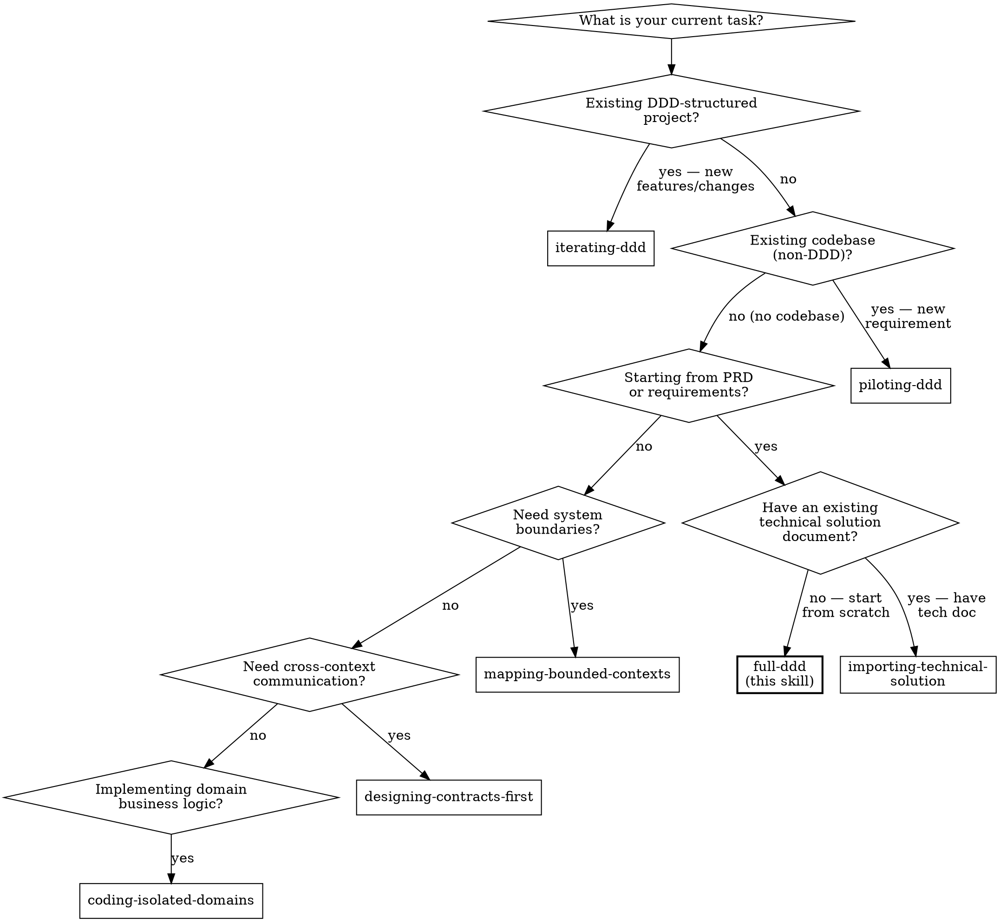

# Running Full DDD Workflow

## Overview
This skill orchestrates the core DDD pipeline — from raw PRD to production-ready, architecture-compliant domain code. **Phase 1** has a mandatory human checkpoint before proceeding. **Phases 2-4** run in **Autonomous Mode** (no per-phase human approval, except at STOP ambiguities). **SDD** generates coding-spec.toml that **Phase 5 (coding) loads and follows**. A **Spec Review Gate** after SDD is a mandatory human checkpoint. A **Project Init Gate** after the Spec Review gives developers control to run code generators and set up the project scaffold before any domain coding begins.

**Foundational Principle:** The pipeline is **mandatory for ALL new projects and modules**, regardless of perceived simplicity. **Phase 1** (event extraction) has a mandatory human gate before proceeding. **Phases 2-4** run in **Autonomous Mode** — the agent executes each phase, persists artifacts immediately, and continues without waiting for approval, using the [Ambiguity Handling Protocol](../_shared/ambiguity-handling-reference.md) to handle uncertainties (STOP for high-radius ambiguities, ASSUME & RECORD for low-radius ones). **SDD** generates coding-spec.toml that Phase 5 loads. A **Spec Review Gate** after SDD surfaces all accumulated assumptions and generated spec files for human review. A **Project Init Gate** after the Spec Review gives developers control to run code generators (`protoc`, `gorm-gen`), pin remote dependencies via `tools.go`, and set up the project scaffold. **Phase 5** (coding) resumes the interactive checkpoint model. There is no complexity threshold below which phases may be skipped. Persistence is mandatory at every phase regardless of checkpoint status. Violating the letter of the rules is violating the spirit of the rules.

**REQUIRED SUB-SKILLS:**
- [extracting-domain-events](../extracting-domain-events/SKILL.md) (Phase 1)
- [mapping-bounded-contexts](../mapping-bounded-contexts/SKILL.md) (Phase 2)
- [designing-contracts-first](../designing-contracts-first/SKILL.md) (Phase 3)
- [architecting-technical-solution](../architecting-technical-solution/SKILL.md) (Phase 4)
- [spec-driven-development](../spec-driven-development/SKILL.md) (SDD)
- [coding-isolated-domains](../coding-isolated-domains/SKILL.md) (Phase 5)
- [test-driven-development](../test-driven-development/SKILL.md) (Phase 5 — coding methodology)

## When to Use


- When starting a new project or module from a PRD / feature spec, or onboarding AI into a codebase lacking DDD structure.
- **When requirements seem "simple"** — especially then. "Simple" task management has hidden complexity: reassignment, escalation, permissions, notifications.

**Do NOT use when:** iterating on an existing DDD-structured project where artifacts have been archived (use [iterating-ddd](../iterating-ddd/SKILL.md)), adding features to an existing non-DDD codebase / legacy / 屎山 (use [piloting-ddd](../piloting-ddd/SKILL.md)), importing an existing technical solution document into DDD format (use [importing-technical-solution](../importing-technical-solution/SKILL.md)), modifying logic within an established Bounded Context (use [coding-isolated-domains](../coding-isolated-domains/SKILL.md)), or only adding a cross-context API (use [designing-contracts-first](../designing-contracts-first/SKILL.md) — if context boundaries are not yet defined, start with [mapping-bounded-contexts](../mapping-bounded-contexts/SKILL.md) first).

## Quick Reference

| Step | Action | Output | Gate |
|:---|:---|:---|:---|
| Phase 1 | extracting-domain-events | Domain Events Table | Human approval |
| Phase 2 | mapping-bounded-contexts | Context Map + Dictionaries | Autonomous (STOP/ASSUME protocol) |
| Phase 3 | designing-contracts-first | Interface Contracts | Autonomous (STOP/ASSUME protocol) |
| Phase 4 | architecting-technical-solution | Technical Solution | Autonomous (STOP/ASSUME protocol) |
| SDD | spec-driven-development | coding-spec.toml | Autonomous (STOP/ASSUME protocol) |
| Spec Review Gate | — | Confirmed specs + assumptions + approved Phase 2-4 artifacts | Human approval |
| Project Init Gate | Developer: code generators + dependency setup | Compilable project scaffold + finalized go.mod | Human confirmation |
| Phase 5 | coding-isolated-domains + test-driven-development | Domain Code + Tests | Human approval |

## Ambiguity Handling

Follow the [Ambiguity Handling Protocol](../_shared/ambiguity-handling-reference.md) throughout the workflow.

In **Autonomous Mode** (Phases 2-4 and SDD when orchestrated by `full-ddd`):
- Apply STOP/ASSUME protocol at every ambiguity
- Append ASSUME entries to `docs/ddd/assumptions-draft.md` immediately
- Do NOT wait for per-phase human approval (except at STOP triggers)
- Persist each phase's artifacts immediately upon completion

In **standalone mode** (atomic skills invoked directly without `full-ddd`):
- The atomic skill's own checkpoints remain active
- STOP/ASSUME protocol is still applied

## Session Recovery

**Before starting any phase work**, check for an existing DDD workflow:

1. Check if `docs/ddd/ddd-progress.md` exists.
2. **If it exists:** Read `ddd-progress.md` and ALL persisted phase artifact files (`phase-1-domain-events.md`, `phase-2-context-map.md`, `phase-3-contracts.md`, `phase-4-technical-solution.md`, `decisions-log.md`). Resume from the first incomplete phase. Run `sh skills/full-ddd/scripts/session-recovery.sh` for a quick status report.
3. **If it does not exist:** Create `docs/ddd/` directory and initialize `ddd-progress.md` from the template in `skills/full-ddd/templates/ddd-progress.md`.

**Persisted artifacts contain human-approved decisions and are authoritative.** Do not discard or re-do completed phases unless the user explicitly requests a rollback.

## Implementation (Interactive Orchestration)

**CRITICAL RULE:** You are the orchestrator. **Phase 1** and **Phase 5** use the interactive checkpoint model (present deliverables + wait for explicit approval). **Phases 2-4 and SDD** run in Autonomous Mode when orchestrated by `full-ddd` (do NOT wait for per-phase approval except at STOP triggers).

### Phase 1 → `extracting-domain-events`
Execute event extraction. Include failure/compensating events. **Checkpoint:** "Does this cover all happy paths AND failure scenarios?"

### Phase 1 Exit Gate (Between Phase 1 and Phase 2)

After Phase 1 is approved AND persisted, present a **Complexity Assessment Summary**:

| Metric | Value |
|:---|:---|
| Total domain events | [count] |
| Failure/compensating events | [count] |
| Distinct actors | [count] |
| Estimated bounded contexts needed | [count] |
| Cross-domain interactions detected | [yes/no, with examples] |
| Business invariants identified | [count] |

Then ask: "Phase 1 is complete. Based on the extracted events, would you like to:
(A) **Continue** the full DDD pipeline (Phase 2: Context Mapping)
(B) **Exit** to simplified mode — skip Phases 2-4, proceed directly to implementation using `coding-isolated-domains`"

**Exit Gate Rules:**
- Agent MUST NOT recommend option B. Present data neutrally.
- Agent MUST NOT add commentary like "this seems simple enough to exit" or "given the low event count, B might be appropriate."
- Only the human may choose B. Agent defaults to A if the response is unclear.
- If human chooses B: update `ddd-progress.md` (workflow_mode: simplified, Exit Gate Result: simplified) + append exit rationale to `decisions-log.md`. Then, before entering `coding-isolated-domains`, present a **Minimal Technical Checklist**: (1) Persistence type? (2) Interface type? (3) Basic error handling strategy? These 3 questions must be answered before coding begins. Append the answers to `docs/ddd/decisions-log.md` under a "Simplified Mode Checklist" entry. **SDD and TDD are not required in simplified mode** — proceed directly to `coding-isolated-domains` after the checklist.
- If human chooses B (simplified mode): STOP/ASSUME protocol still applies during simplified implementation. Record ASSUME entries to `docs/ddd/assumptions-draft.md`. Present a simplified Spec Review before any coding.

### Phase 2 → `mapping-bounded-contexts` (Autonomous Mode)
Cluster events into Bounded Contexts, classify, map relationships, build dictionaries, and generate constraint files. Apply Ambiguity Handling Protocol: STOP for context boundary assignments and strategic classification; ASSUME & RECORD for naming and synonym lists. **Persist `docs/ddd/phase-2-context-map.md` immediately upon completion. Do NOT wait for human approval.** Continue to Phase 3.

### Phase 3 → `designing-contracts-first` (Autonomous Mode)
Draft pure interface contracts. Boundary Challenge becomes an agent self-check (not a human gate) in this mode. Apply Ambiguity Handling Protocol: STOP for data shape, sync/async choice, and error contracts; ASSUME & RECORD for naming and field ordering. **Persist `docs/ddd/phase-3-contracts.md` immediately upon completion. Do NOT wait for human approval.** Continue to Phase 4.

### Phase 4 → `architecting-technical-solution` (Autonomous Mode)
Walk all 7 dimensions at depth appropriate to strategic classification. Dimension Challenge becomes an agent self-check in this mode. Apply Ambiguity Handling Protocol: STOP for persistence technology, consistency strategy, and interface type; ASSUME & RECORD for library versions and non-critical details. **Persist `docs/ddd/phase-4-technical-solution.md` immediately upon completion. Do NOT wait for human approval.** Proceed to SDD.

### SDD → `spec-driven-development` (Autonomous Mode)
Generate formal spec files from Phase 3 contracts + Phase 4 tech decisions. Execute [spec-driven-development](../spec-driven-development/SKILL.md) in Generate mode (or Merge mode if `specs/` already exists). Apply Ambiguity Handling Protocol: STOP for protocol conflicts, breaking changes, and three-way merge conflicts; ASSUME & RECORD for syntax version, field optionality, and error naming. **Write spec files to `specs/` and persist `docs/ddd/spec-manifest.md` immediately upon completion. Do NOT wait for human approval.** Proceed to Spec Review Gate.

### Spec Review Gate (after SDD, before Phase 5)

**MANDATORY hard stop before any coding begins.**

1. Present the following to the developer:
   - `docs/ddd/phase-2-context-map.md` (summary)
   - `docs/ddd/phase-3-contracts.md` (summary)
   - `docs/ddd/phase-4-technical-solution.md` (summary)
   - `docs/ddd/spec-manifest.md` (full contents — coverage table + error completeness)
   - Key spec files from `specs/` (one aggregate representative sample)
   - `docs/ddd/assumptions-draft.md` (full contents — all accumulated ASSUME entries)
2. Developer reviews each `[ASSUMPTION]` entry: ✅ Keep | ✏️ Revise to: [alternative]
3. For any REVISED entry: run rollback impact check. If the revision affects an upstream phase artifact, roll back to that phase and re-execute forward. If it affects spec files, re-run SDD Merge mode on the affected aggregates.
4. Once all entries confirmed: append all entries to `docs/ddd/decisions-log.md` with status CONFIRMED or REVISED. Delete `docs/ddd/assumptions-draft.md`.
5. **Only after the developer's explicit approval of the Spec Review → proceed to Project Init Gate.**

**Checkpoint:** "The Spec Review Gate is complete. All design assumptions and spec files are confirmed. Before I start coding, please complete project initialization."

### Project Init Gate (after Spec Review, before Phase 5)

**MANDATORY human checkpoint before any domain coding begins.**

Spec files are confirmed and ready. Before the agent writes domain code, the developer sets up the project scaffold — running code generators, creating the DB schema, and pinning dependencies. This ensures the agent codes into a compilable, properly configured project, and catches spec file issues (e.g., proto won't compile) before Phase 5 starts.

**Developer checklist (reference `docs/ddd/phase-4-technical-solution.md` for what applies to this project):**

1. **Install generated dependencies** — ensure remote generated-code packages are published (e.g., push proto definitions → CI runs `protoc` → published to private pb-go repo), then `go get` them into the project.
2. **Pin not-yet-used dependencies** — create `tools.go` with `//go:build tools` and blank imports for packages that Phase 5 domain code won't import but adapters will need later (e.g., proto-go types). This prevents `go mod tidy` from removing them before adapter code is written.
3. **Run local code generators and project setup** — `gorm-gen` (reads DB DDL), `sqlc`, DB schema migration, `go mod tidy`, directory structure, config templates, and any other scaffolding indicated by the technical solution.

**Checkpoint:** "Spec Review is complete. Please set up the project scaffold — install dependencies, pin future adapter imports via `tools.go`, run code generators — as indicated by `docs/ddd/phase-4-technical-solution.md`. Reply **'ready for Phase 5'** when done."

**Gate Rules:**
- Agent MUST NOT run code generators autonomously — these depend on developer environment and toolchain configuration.
- Agent MUST wait for explicit "ready for Phase 5" confirmation before starting `coding-isolated-domains`.
- If developers encounter compilation errors or spec issues during this gate (e.g., `protoc` fails on a proto file), agent SHOULD assist debugging. If the fix requires spec changes, re-run SDD Merge mode on the affected spec files and re-present for review.

### Phase 5 → `coding-isolated-domains` + `test-driven-development`
For each Core Domain context first, then Supporting, then Generic: use [test-driven-development](../test-driven-development/SKILL.md) to drive implementation via MAP → ITERATE → DIFF cycle, grounded in the spec files generated by SDD. Follow [coding-isolated-domains](../coding-isolated-domains/SKILL.md) architecture constraints throughout. **Checkpoint** at each sub-step.

**PIPELINE COMPLETE.** All five phases executed and artifacts persisted in `docs/ddd/`.

**Archive this iteration:**
```
sh skills/full-ddd/scripts/archive-artifacts.sh
```
This moves all phase artifacts and `ddd-progress.md` into `docs/ddd/archive/v{N}/`. The `docs/ddd/` directory is left clean so the next requirement starts from Phase 1 with no stale context. The archive is a human-readable historical record — it is NOT loaded by the agent on the next session.

For iterating on this project after archival (adding features, extending contexts, evolving the domain model), use [iterating-ddd](../iterating-ddd/SKILL.md) — it rebuilds the baseline from code and routes new requirements through only the necessary phases.

## Phase Transition Rules

| Transition | Required Input | Gate | Persistence |
|:---|:---|:---|:---|
| Start → Phase 1 | PRD / requirements text | User provides input | Create `docs/ddd/` + `ddd-progress.md` + set up platform-specific hooks (see Platform-Specific Hooks) |
| Phase 1 → Exit Gate | Approved Domain Events Table | User says "approved" or equivalent | Write `docs/ddd/phase-1-domain-events.md` + update `ddd-progress.md` + append to `decisions-log.md` |
| Exit Gate → Phase 2 | User chooses "Continue" at Exit Gate | User says "continue" or equivalent | Update `ddd-progress.md` Exit Gate Result = continue |
| Exit Gate → Simplified | User chooses "Exit" at Exit Gate | User explicitly says "exit" / "simplified" | Update `ddd-progress.md` workflow_mode = simplified + append exit rationale + Minimal Technical Checklist answers to `decisions-log.md` |
| Phase 2 → Phase 3 | Approved Context Map + Dictionaries + Rule files generated | Autonomous (STOP/ASSUME protocol) | Write `docs/ddd/phase-2-context-map.md` + update `ddd-progress.md` + append to `decisions-log.md` |
| Phase 3 → Phase 4 | Approved Interface Contracts + Strategic Classification | Autonomous (STOP/ASSUME protocol) | Write `docs/ddd/phase-3-contracts.md` + update `ddd-progress.md` + append to `decisions-log.md` |
| Phase 4 → SDD | Approved Technical Solution | Autonomous (STOP/ASSUME protocol) | Write `docs/ddd/phase-4-technical-solution.md` + update `ddd-progress.md` + append to `decisions-log.md` |
| SDD → Spec Review Gate | Generated spec files | Autonomous (STOP/ASSUME protocol) | Write spec files to `specs/` + write `docs/ddd/spec-manifest.md` + update `ddd-progress.md` + append to `decisions-log.md` |
| Spec Review → Project Init Gate | Confirmed assumptions + approved specs + Phase 2-4 artifacts | Developer explicitly approves | Append all ASSUMPTION entries to `docs/ddd/decisions-log.md`. Delete `docs/ddd/assumptions-draft.md`. |
| Project Init Gate → Phase 5 | Project scaffold ready (generators run, deps pinned) | User says "ready for Phase 5" | — (developer-side work, no agent artifacts) |
| Phase 5 Complete | Code + Tests approved | User says "approved" | Update `ddd-progress.md` status = complete + append to `decisions-log.md` + run `archive-artifacts.sh` |

**Persistence is MANDATORY at every phase gate.** Write the approved deliverable to the corresponding file in `docs/ddd/` BEFORE starting the next phase. Templates are in `skills/full-ddd/templates/`.

**If at ANY phase the user requests changes that invalidate a previous phase's output → roll back to that phase and re-execute forward.** Update persisted artifacts accordingly.

## Self-Check Protocol

Follow the [Persistence Defense Reference](../_shared/persistence-defense-reference.md) at every phase gate, with this context-specific item 4:

4. **Phase 4 Artifact Exists:** After Phase 4 completes, verify `docs/ddd/phase-4-technical-solution.md` exists.

5. **SDD Artifacts Exist:** After SDD completes, verify `docs/ddd/spec-manifest.md` exists and `specs/` contains spec files for every Phase 3 contract interface.

6. **Assumptions Draft Persisted:** If any ASSUME & RECORD decisions were made, verify `docs/ddd/assumptions-draft.md` exists and contains the entries.

7. **TDD Artifacts Exist:** After Phase 5 completes, verify `docs/ddd/test-map.md` and `docs/ddd/test-coverage.md` exist.

8. **Archive Completed:** After Phase 5 approval and `archive-artifacts.sh` runs, verify `docs/ddd/ddd-progress.md` no longer exists. If it still exists, the archive did not run — run it before ending the session.

See [Persistence Defense Reference](../_shared/persistence-defense-reference.md) for platform-specific hooks configuration and the three-layer defense model.

## End-to-End Example

For a complete walkthrough demonstrating all five phases on a realistic e-commerce scenario, see [example-ecommerce.md](example-ecommerce.md).

## Rationalization Table

These are real excuses agents use to bypass the pipeline rules. Every one of them is wrong.

| Excuse | Reality |
|:---|:---|
| "Pipeline is only for complex systems" | No complexity threshold. "Simple" projects have hidden complexity that only surfaces through systematic analysis. |
| "DDD ceremony is proportional to complexity" | The pipeline prevents building on incomplete foundations. Proportional ceremony = proportional gaps. |
| "Simple requirements don't need formal analysis" | Simple requirements create false confidence. Discovering gaps during implementation is 10x more expensive. |
| "Time/demo pressure justifies skipping" | Demo built on unvalidated foundations costs more to fix than the time saved by skipping. |
| "Patch forward — incremental change" | No severity threshold for rollback. ANY change invalidating a previous phase requires re-execution. |
| "Rollback is only for fundamental errors" | Rollback is for ANY invalidation. Patching forward risks cascading inconsistencies. |
| "Preserve existing work / avoid rework" | Sunk cost is irrelevant. Building on invalidated foundations creates MORE rework than rolling back. |
| "Auto-advance — output looks complete" | "Looks complete" ≠ "explicitly approved." Auto-advancing bypasses the user's right to review. |
| "I'll proceed unless you object" | Implicit consent ≠ explicit approval. Shifts burden to user and creates social pressure to stay silent. |
| "CTO/org authority overrides the pipeline" | Organizational hierarchy does not override architectural invariants. Rollback when phase is invalidated — regardless of who says otherwise. |
| "Design docs are in the chat history" | Chat history is volatile. Agent context resets lose all design artifacts. Only filesystem persists. |
| "Constraint files already capture the design" | Constraint files contain enforcement rules, not full design rationale. Missing events table, context map, and decision history. |
| "I'll write all files at the end" | "At the end" may never come. Context resets mid-workflow lose everything. Each phase gate is an atomic checkpoint. |
| "Existing progress files might be outdated" | Persisted files contain human-approved decisions. If requirements changed, the user will say so. Don't assume invalidation. |
| "Writing files interrupts the design flow" | A 30-second file write prevents hours of re-work after context loss. The interruption IS the protection. |
| "Partial persistence avoids duplication" | Design artifacts and constraint files serve different audiences (human traceability vs AI enforcement). Both are mandatory. |
| "Hooks aren't configured on this platform, so persistence checks are optional" | Hooks are Layer 1. The Self-Check Protocol (Layer 2) is mandatory on ALL platforms regardless of hooks configuration. No platform excuse cancels the self-check. |
| "The user's project already has hooks config, I shouldn't modify it" | Merge DDD hooks into existing config, do not overwrite. If unable to merge, the Self-Check Protocol is the fallback. Skipping hooks setup entirely is not an option. |
| "Only 5 events — the exit gate suggests this is simple enough to skip" | The exit gate is a HUMAN decision point, not an agent recommendation. Event count alone does not determine complexity. Present data, do not interpret. |
| "I'll recommend exit to save the user time" | Recommending exit violates neutrality. The agent defaults to Continue. Only the human may choose Exit. |
| "User seems to want to move fast, I'll suggest simplified mode" | Reading social cues to suggest exit is still a recommendation. Present the assessment, ask the question, wait. |
| "Skip technical solution — contracts already imply tech decisions" | Contracts define WHAT interfaces look like, not HOW they're realized technically. `InventoryServicePort` doesn't decide HTTP vs gRPC vs async. |
| "Autonomous mode means no persistence needed" | Persistence is mandatory regardless of checkpoint status. Autonomous mode skips approval gates, not file writes. Every phase must write its artifact immediately. |
| "Skip SDD — contracts are detailed enough to code directly" | Contracts are markdown — not compilable. SDD transforms design artifacts into toolchain-consumable spec files. Skipping SDD means implementation invents interface shapes, reintroducing hallucination at the structural level. |
| "SDD adds ceremony — Phase 4 already chose gRPC/REST" | Choosing gRPC is not the same as writing the proto. SDD generates the actual `.proto`/`.yaml` files that toolchains validate and code generators consume. The choice means nothing without the artifact. |
| "Skip the Spec Review Gate, I'll catch spec issues in Phase 5" | The Spec Review Gate is the only moment spec files AND design assumptions are visible together. Skipping it means coding from unvalidated specs on unconfirmed assumptions. |
| "ASSUME decisions don't need recording in autonomous mode" | Unrecorded assumptions are invisible at the Spec Review Gate. The developer cannot review what was never written. Record every ASSUME immediately. |
| "I'll archive later / skip archive for now" | Unarchived artifacts pollute the next iteration's Session Recovery. The archive step is part of pipeline completion — not optional cleanup. |
| "Skip the Project Init Gate — spec files look fine, jump straight to Phase 5" | `protoc` or `gorm-gen` may fail on specs that look correct to a human. The Init Gate catches compilation errors before the agent writes domain code. Skipping it risks Phase 5 building on broken specs. |
| "I'll run the code generators autonomously — protoc/gorm-gen is straightforward" | Code generators depend on developer environment, toolchain versions, and local DB schema. Running them without developer confirmation risks incompatible output. The developer runs generators; the agent assists if errors occur. |
| "I'll read the old artifacts as context for the new requirement" | Old artifacts may not reflect current code. The archive is a human record, not agent input. Start fresh from Phase 1. |

## Red Flags — STOP and Follow the Pipeline

If you catch yourself thinking "too simple for the full pipeline", "patch forward", "proceed without waiting for approval", "the design is already in the chat", "I'll persist the files later", "hooks aren't set up so I'll skip checks", "this is simple enough to recommend exit", "skip SDD — contracts are enough", "skip the Spec Review Gate", "I'll archive later", "skip the Project Init Gate", "I'll run code generators autonomously", or "I'll read the old artifacts as context" — **STOP. Follow the pipeline. Wait for explicit approval. Persist every approved deliverable to `docs/ddd/` and `specs/` immediately. Roll back when ANY previous phase is invalidated. Present exit gates neutrally. Archive on completion. Start fresh from Phase 1. No exceptions.**
