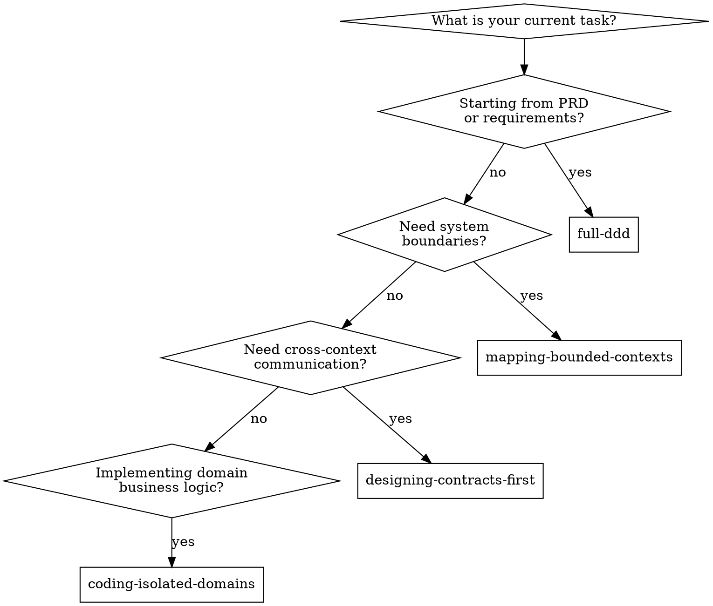

# Running Full DDD Workflow

## Overview
This skill orchestrates the five core DDD skills into a single, end-to-end pipeline: from raw PRD to production-ready, architecture-compliant domain code. Each phase has a mandatory human checkpoint — no phase may begin until the previous phase's output is explicitly approved.

**Foundational Principle:** The 5-phase pipeline is **mandatory for ALL new projects and modules**, regardless of perceived simplicity. There is no complexity threshold below which phases may be skipped. There is no severity threshold below which rollback may be replaced with "patching forward." Every phase gate requires **explicit human approval** — no auto-advancing, no implicit consent, no "unless you object" framing. Violating the letter of the rules is violating the spirit of the rules.

**REQUIRED SUB-SKILLS:**
- `extracting-domain-events` (Phase 1)
- `mapping-bounded-contexts` (Phase 2)
- `designing-contracts-first` (Phase 3)
- `architecting-technical-solution` (Phase 4)
- `coding-isolated-domains` (Phase 5)

## When to Use

- When starting a new project or module from a PRD / feature spec, or onboarding AI into a codebase lacking DDD structure.
- **When requirements seem "simple"** — especially then. "Simple" task management has hidden complexity: reassignment, escalation, permissions, notifications.

**Do NOT use when:** modifying logic within an established Bounded Context (use `coding-isolated-domains`) or only adding a cross-context API (use `designing-contracts-first`).

## Quick Reference

| Phase   | Skill                           | Output                     | Gate           |
| :------ | :------------------------------ | :------------------------- | :------------- |
| Phase 1 | extracting-domain-events        | Domain Events Table        | Human approval |
| Phase 2 | mapping-bounded-contexts        | Context Map + Dictionaries | Human approval |
| Phase 3 | designing-contracts-first       | Interface Contracts        | Human approval |
| Phase 4 | architecting-technical-solution | Technical Solution         | Human approval |
| Phase 5 | coding-isolated-domains         | Rich Domain Code + Tests   | Human approval |

## Session Recovery

**Before starting any phase work**, check for an existing DDD workflow:

1. Check if `docs/ddd/ddd-progress.md` exists.
2. **If it exists:** Read `ddd-progress.md` and ALL persisted phase artifact files (`phase-1-domain-events.md`, `phase-2-context-map.md`, `phase-3-contracts.md`, `phase-4-technical-solution.md`, `decisions-log.md`). Resume from the first incomplete phase. Run `sh skills/full-ddd/scripts/session-recovery.sh` for a quick status report.
3. **If it does not exist:** Create `docs/ddd/` directory and initialize `ddd-progress.md` from the template in `skills/full-ddd/assets/templates/ddd-progress.md`.

**Persisted artifacts contain human-approved decisions and are authoritative.** Do not discard or re-do completed phases unless the user explicitly requests a rollback.

## Implementation (Interactive Orchestration)

**CRITICAL RULE:** You are the orchestrator. At the end of each phase, you MUST present the deliverable to the user and wait for explicit approval before proceeding. Never auto-advance.

### Phase 1 → `extracting-domain-events`
Execute event extraction. Include failure/compensating events. **Checkpoint:** "Does this cover all happy paths AND failure scenarios?"

### Phase 1 Exit Gate (Between Phase 1 and Phase 2)

After Phase 1 is approved AND persisted, present a **Complexity Assessment Summary**:

| Metric                             | Value                   |
| :--------------------------------- | :---------------------- |
| Total domain events                | [count]                 |
| Failure/compensating events        | [count]                 |
| Distinct actors                    | [count]                 |
| Estimated bounded contexts needed  | [count]                 |
| Cross-domain interactions detected | [yes/no, with examples] |
| Business invariants identified     | [count]                 |

Then ask: "Phase 1 is complete. Based on the extracted events, would you like to:
(A) **Continue** the full DDD pipeline (Phase 2: Context Mapping)
(B) **Exit** to simplified mode — skip Phases 2-4, proceed directly to implementation using `coding-isolated-domains`"

**Exit Gate Rules:**
- Agent MUST NOT recommend option B. Present data neutrally.
- Agent MUST NOT add commentary like "this seems simple enough to exit" or "given the low event count, B might be appropriate."
- Only the human may choose B. Agent defaults to A if the response is unclear.
- If human chooses B: update `ddd-progress.md` (workflow_mode: simplified, Exit Gate Result: simplified) + append exit rationale to `decisions-log.md`. Then, before entering `coding-isolated-domains`, present a **Minimal Technical Checklist** (inline, no artifact persistence required): (1) Persistence type? (2) Interface type? (3) Basic error handling strategy? These 3 questions must be answered before coding begins.

### Phase 2 → `mapping-bounded-contexts`
Cluster events into Bounded Contexts, classify, map relationships, build dictionaries. **Checkpoint:** "Do these boundaries align with the business structure?" After approval, auto-generate constraint files.

### Phase 3 → `designing-contracts-first`
Draft pure interface contracts. Run Boundary Challenge. **Checkpoint:** "Do these contracts fulfill both sides without leaking internal business rules?" No implementation until approved.

### Phase 4 → `architecting-technical-solution`
Execute technical solution design with adaptive depth based on Phase 2 strategic classification (Core Domain → Full RFC, Supporting → Medium, Generic → Lightweight). Walk all 7 dimensions. **Checkpoint:** "Are these technical decisions grounded in the domain events and contracts, or speculative?"

### Phase 5 → `coding-isolated-domains`
For each Core Domain context first, then Supporting, then Generic: propose Aggregate Root, TDD first, then implement Rich Domain Model. **Checkpoint** at each sub-step.

## Phase Transition Rules

| Transition             | Required Input                                             | Gate                                       | Persistence                                                                                              |
| :--------------------- | :--------------------------------------------------------- | :----------------------------------------- | :------------------------------------------------------------------------------------------------------- |
| Start → Phase 1        | PRD / requirements text                                    | User provides input                        | Create `docs/ddd/` + `ddd-progress.md` + set up platform-specific hooks (see Platform-Specific Hooks)    |
| Phase 1 → Exit Gate    | Approved Domain Events Table                               | User says "approved" or equivalent         | Write `docs/ddd/phase-1-domain-events.md` + update `ddd-progress.md` + append to `decisions-log.md`      |
| Exit Gate → Phase 2    | User chooses "Continue" at Exit Gate                       | User says "continue" or equivalent         | Update `ddd-progress.md` Exit Gate Result = continue                                                     |
| Exit Gate → Simplified | User chooses "Exit" at Exit Gate                           | User explicitly says "exit" / "simplified" | Update `ddd-progress.md` workflow_mode = simplified + append exit rationale to `decisions-log.md`        |
| Phase 2 → Phase 3      | Approved Context Map + Dictionaries + Rule files generated | User says "approved"                       | Write `docs/ddd/phase-2-context-map.md` + update `ddd-progress.md` + append to `decisions-log.md`        |
| Phase 3 → Phase 4      | Approved Interface Contracts + Strategic Classification    | User says "approved"                       | Write `docs/ddd/phase-3-contracts.md` + update `ddd-progress.md` + append to `decisions-log.md`          |
| Phase 4 → Phase 5      | Approved Technical Solution                                | User says "approved"                       | Write `docs/ddd/phase-4-technical-solution.md` + update `ddd-progress.md` + append to `decisions-log.md` |
| Phase 5 Complete       | Code + Tests approved                                      | User says "approved"                       | Update `ddd-progress.md` status = complete + append to `decisions-log.md`                                |

**Persistence is MANDATORY at every phase gate.** Write the approved deliverable to the corresponding file in `docs/ddd/` BEFORE starting the next phase. Templates are in `skills/full-ddd/assets/templates/`.

**If at ANY phase the user requests changes that invalidate a previous phase's output → roll back to that phase and re-execute forward.** Update persisted artifacts accordingly.

## Self-Check Protocol

**MANDATORY on ALL platforms, regardless of whether hooks are configured.**

At every phase gate (before proceeding to the next phase), the orchestrator MUST execute this verification sequence:

1. **Artifact Exists:** Verify the artifact file for the completed phase EXISTS on disk (use Read/ls). For example, after Phase 1 approval, verify `docs/ddd/phase-1-domain-events.md` exists.
2. **Progress Updated:** Verify `docs/ddd/ddd-progress.md` shows the completed phase as `complete`.
3. **Decisions Logged:** Verify `docs/ddd/decisions-log.md` was appended with the phase's key decisions.
4. **Phase 4 Artifact Exists:** After Phase 4 approval, verify `docs/ddd/phase-4-technical-solution.md` exists.

**If ANY check fails → STOP. Write the missing file. Do NOT proceed to the next phase.**

This protocol is the universal fallback (Layer 2). Even if platform-native hooks (Layer 1) are misconfigured or absent, the Self-Check Protocol guarantees persistence enforcement through prompt-level instructions. You can also run the shell scripts manually: `sh skills/full-ddd/scripts/check-persistence.sh` and `sh skills/full-ddd/scripts/verify-artifacts.sh`.

## Platform-Specific Hooks

Hooks provide automated runtime verification (Layer 1). They call shared shell scripts (Layer 3) that check artifact persistence at key lifecycle points. During the **Start → Phase 1** initialization, detect the Agent platform and set up the corresponding hooks configuration.

| Platform        | Config Location                              | Hook Mapping                                             | Template                                    |
| :-------------- | :------------------------------------------- | :------------------------------------------------------- | :------------------------------------------ |
| **Claude Code** | SKILL.md frontmatter (already defined above) | `PreToolUse` / `PostToolUse` / `Stop`                    | N/A (built-in)                              |
| **Cursor**      | `.cursor/hooks.json` (project-level)         | `preToolUse` / `postToolUse` / `stop`                    | `templates/cursor-hooks.json`               |
| **Windsurf**    | `.windsurf/hooks.json` (project-level)       | `pre_read_code` / `post_write_code` / `post_run_command` | `templates/windsurf-hooks.json`             |
| **OpenCode**    | `.opencode/plugins/ddd-workflow.ts`          | `tool.execute.before` / `tool.execute.after` / `stop`    | `templates/opencode-ddd-plugin.ts`          |
| **Antigravity** | `.gemini/settings.json`                      | `BeforeTool` / `AfterTool` / `AfterAgent`                | `templates/antigravity-hooks-settings.json` |

### Hooks Setup During Initialization

When creating the `docs/ddd/` directory at workflow start, also set up platform-native hooks:

1. **Detect the Agent platform** by checking which config directories exist (`.cursor/`, `.windsurf/`, `.opencode/`, `.gemini/`) or by the user's environment.
2. **Generate or merge** the hooks config from the corresponding template in `skills/full-ddd/assets/templates/`. If the project already has an existing hooks config file, **merge** the DDD hooks into it — do NOT overwrite the user's existing hooks.
3. **Claude Code** hooks are already defined in this skill's YAML frontmatter and require no additional setup.

### Three-Layer Defense

- **Layer 1 — Platform-Native Hooks:** Automated runtime checks triggered by the IDE at tool execution lifecycle points. Platform-specific configuration required.
- **Layer 2 — Self-Check Protocol:** Prompt-level verification instructions embedded in this skill. Works on ALL platforms with zero configuration. The universal fallback.
- **Layer 3 — Shared Shell Scripts:** `check-persistence.sh`, `verify-artifacts.sh`, `session-recovery.sh`. Called by both Layer 1 (hooks) and Layer 2 (manual invocation).

## End-to-End Example

For a complete walkthrough demonstrating all five phases on a realistic e-commerce scenario, see [example-ecommerce.md](example-ecommerce.md).

## Rationalization Table

These are real excuses agents use to bypass the pipeline rules. Every one of them is wrong.

| Excuse                                                                         | Reality                                                                                                                                                              |
| :----------------------------------------------------------------------------- | :------------------------------------------------------------------------------------------------------------------------------------------------------------------- |
| "Pipeline is only for complex systems"                                         | No complexity threshold. "Simple" projects have hidden complexity that only surfaces through systematic analysis.                                                    |
| "DDD ceremony is proportional to complexity"                                   | The pipeline prevents building on incomplete foundations. Proportional ceremony = proportional gaps.                                                                 |
| "Simple requirements don't need formal analysis"                               | Simple requirements create false confidence. Discovering gaps during implementation is 10x more expensive.                                                           |
| "Time/demo pressure justifies skipping"                                        | Demo built on unvalidated foundations costs more to fix than the time saved by skipping.                                                                             |
| "Patch forward — incremental change"                                           | No severity threshold for rollback. ANY change invalidating a previous phase requires re-execution.                                                                  |
| "Rollback is only for fundamental errors"                                      | Rollback is for ANY invalidation. Patching forward risks cascading inconsistencies.                                                                                  |
| "Preserve existing work / avoid rework"                                        | Sunk cost is irrelevant. Building on invalidated foundations creates MORE rework than rolling back.                                                                  |
| "Auto-advance — output looks complete"                                         | "Looks complete" ≠ "explicitly approved." Auto-advancing bypasses the user's right to review.                                                                        |
| "I'll proceed unless you object"                                               | Implicit consent ≠ explicit approval. Shifts burden to user and creates social pressure to stay silent.                                                              |
| "CTO/org authority overrides the pipeline"                                     | Organizational hierarchy does not override architectural invariants. Rollback when phase is invalidated — regardless of who says otherwise.                          |
| "Design docs are in the chat history"                                          | Chat history is volatile. Agent context resets lose all design artifacts. Only filesystem persists.                                                                  |
| "Constraint files already capture the design"                                  | Constraint files contain enforcement rules, not full design rationale. Missing events table, context map, and decision history.                                      |
| "I'll write all files at the end"                                              | "At the end" may never come. Context resets mid-workflow lose everything. Each phase gate is an atomic checkpoint.                                                   |
| "Existing progress files might be outdated"                                    | Persisted files contain human-approved decisions. If requirements changed, the user will say so. Don't assume invalidation.                                          |
| "Writing files interrupts the design flow"                                     | A 30-second file write prevents hours of re-work after context loss. The interruption IS the protection.                                                             |
| "Partial persistence avoids duplication"                                       | Design artifacts and constraint files serve different audiences (human traceability vs AI enforcement). Both are mandatory.                                          |
| "Hooks aren't configured on this platform, so persistence checks are optional" | Hooks are Layer 1. The Self-Check Protocol (Layer 2) is mandatory on ALL platforms regardless of hooks configuration. No platform excuse cancels the self-check.     |
| "The user's project already has hooks config, I shouldn't modify it"           | Merge DDD hooks into existing config, do not overwrite. If unable to merge, the Self-Check Protocol is the fallback. Skipping hooks setup entirely is not an option. |
| "Only 5 events — the exit gate suggests this is simple enough to skip"         | The exit gate is a HUMAN decision point, not an agent recommendation. Event count alone does not determine complexity. Present data, do not interpret.               |
| "I'll recommend exit to save the user time"                                    | Recommending exit violates neutrality. The agent defaults to Continue. Only the human may choose Exit.                                                               |
| "User seems to want to move fast, I'll suggest simplified mode"                | Reading social cues to suggest exit is still a recommendation. Present the assessment, ask the question, wait.                                                       |
| "Skip technical solution — contracts already imply tech decisions"             | Contracts define WHAT interfaces look like, not HOW they're realized technically. `InventoryServicePort` doesn't decide HTTP vs gRPC vs async.                       |

## Red Flags — STOP and Follow the Pipeline

If you catch yourself thinking "too simple for the full pipeline", "patch forward", "proceed without waiting for approval", "the design is already in the chat", "I'll persist the files later", "hooks aren't set up so I'll skip checks", or "this is simple enough to recommend exit" — **STOP. Follow the pipeline. Wait for explicit approval. Persist every approved deliverable to `docs/ddd/` immediately. Roll back when ANY previous phase is invalidated. Present exit gates neutrally. No exceptions.**
