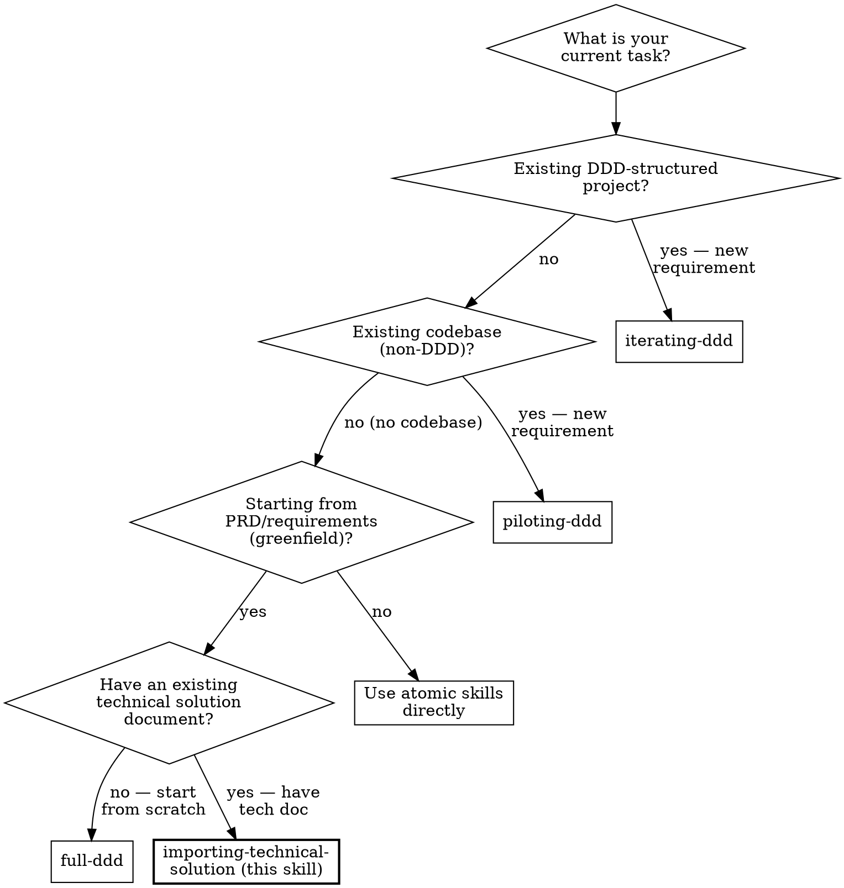

# Importing Technical Solution

## Overview
This skill bridges existing technical solutions into the DDD pipeline. It reverse-extracts structured DDD phase artifacts (Domain Events, Context Map, Contracts, Technical Solution) from an existing architecture document, validates coverage against the 7 technical dimensions, fills gaps through interactive Q&A, and persists all artifacts for downstream domain implementation.

**Foundational Principle:** Imported artifacts are **NOT pre-approved**. Each reverse-extracted artifact must pass explicit human approval before it is persisted. The source document's prior approval context is irrelevant — DDD artifacts require separate validation of the EXTRACTION accuracy. All rules in this skill are mandatory constraints. There is no complexity threshold below which you may skip reverse-extraction.

**REQUIRED SUB-SKILLS:**
- [spec-driven-development](../spec-driven-development/SKILL.md) (Step 7 handoff — generate spec files from imported artifacts)
- [coding-isolated-domains](../coding-isolated-domains/SKILL.md) (Phase 5 — implementation)
- [test-driven-development](../test-driven-development/SKILL.md) (Phase 5 — coding methodology)

## When to Use
- When user has an existing technical solution (architecture doc, design spec, ADR) and wants to enter the DDD pipeline.
- When a tech solution exists but lacks structured DDD artifacts (domain events, context maps, contracts).
- When onboarding a project with existing architecture decisions into the DDD workflow.
- When reverse-engineering an existing system's design into phase-by-phase DDD documentation.

**Do NOT use when:** no tech solution exists (use [full-ddd](../full-ddd/SKILL.md) to start from PRD), iterating on an existing DDD-structured project (use [iterating-ddd](../iterating-ddd/SKILL.md)), modifying logic within an established Bounded Context (use [coding-isolated-domains](../coding-isolated-domains/SKILL.md)), adding features to an existing non-DDD codebase (use [piloting-ddd](../piloting-ddd/SKILL.md)), or the task is purely technical with no domain change.

### Skill Selection



## Quick Reference

| Step | Action | Output | Gate |
|:---|:---|:---|:---|
| 0 | Pre-flight Checks | Input validated + source persisted | — |
| 1 | Reverse-Extract Phase 1 | Domain Events Table | Human approval |
| 2 | Reverse-Extract Phase 2 | Context Map | Autonomous persist (STOP blocks) |
| 3 | Reverse-Extract Phase 3 | Interface Contracts | Autonomous persist (STOP blocks) |
| 4 | Validate 7 Dimensions | Coverage table (COVERED/PARTIAL/MISSING) | — |
| 5 | Fill Gaps | Gap decisions recorded | Human approval per gap |
| 6 | Persist Phase 4 | `docs/ddd/phase-4-technical-solution.md` | Human approval |
| 7 | Handoff | Next steps to user | — |

## Ambiguity Handling

Follow the [Ambiguity Handling Protocol](../_shared/ambiguity-handling-reference.md) throughout this workflow.

The existing `[GAP — not in source document]` marker is now replaced with the standard [Ambiguity Handling Protocol](../_shared/ambiguity-handling-reference.md) tiers:

- **`[STOP: {description}]`** — The missing information affects event identification, context boundaries, or contracts. Confirm with the developer before proceeding.
- **`[ASSUMPTION: {description}]`** — The missing information is low-impact (naming, ordering, non-critical dimension details). Make the most conservative assumption, record it, and continue.

The `[ASSUMPTION]` marker format:

```
[ASSUMPTION: {what is missing from source}]
├─ Chosen: {the assumption made}
├─ Alternative: {other reasonable option}
└─ Change cost: LOW | MEDIUM
```

Append `[ASSUMPTION]` entries to `docs/ddd/assumptions-draft.md` immediately as they occur.

**Import STOP triggers — confirm immediately:**

| Ambiguity | Why STOP |
|:----------|:---------|
| Missing event or business rule in source (Step 1) | Invented events cascade to wrong context boundaries and contracts |
| Context boundary assignment unclear from source (Step 2) | Wrong boundaries = wrong aggregate scope → Phase 3 contracts must redo |
| Strategic classification (Core/Supporting/Generic) unclear (Step 2) | Wrong classification = wrong analysis depth → Phase 4 dimensions under-specified |
| Contract data shape or communication pattern unclear (Step 3) | Wrong interface shape = wrong port definitions → Phase 5 aggregate design must redo |

**Import ASSUME & RECORD — proceed with explicit assumption:**

| Ambiguity | Default assumption |
|:----------|:------------------|
| Event naming wording | Choose most natural past-tense business term |
| Field ordering in contracts | Alphabetical; record assumption |
| Dimension details below PARTIAL threshold | Choose simpler option; record assumption |
| Synonym completeness in ubiquitous language | Record known terms; mark dictionary as potentially incomplete |

## Session Recovery

**Before starting any step**, check for an existing import workflow:

1. Check if `docs/ddd/ddd-progress.md` exists with `workflow_mode: import`.
2. **If it exists:** Read `ddd-progress.md`, `import-source.md`, and ALL persisted phase artifact files (`phase-1-domain-events.md`, `phase-2-context-map.md`, `phase-3-contracts.md`, `phase-4-technical-solution.md`, `decisions-log.md`). Resume from the first incomplete phase gate.
3. **If it does not exist:** Proceed with Step 0 (Pre-flight Checks).

**Persisted artifacts contain human-approved decisions and are authoritative.** Do not discard or re-do completed phases unless the user explicitly requests a rollback.

Run `sh skills/full-ddd/scripts/session-recovery.sh` for a quick status report of the current DDD workflow state.

## Implementation (Interactive Q&A Session)

**CRITICAL RULE:** Do NOT just generate the final output and stop. You must guide the user through an interactive, step-by-step import process.

### Step 0: Pre-flight Checks

| Check | Action | Failure |
|:------|:-------|:--------|
| **Existing artifacts** | Check if `docs/ddd/` has existing artifacts. List them. | WARN user: "Existing DDD artifacts found: [list]. Importing will overwrite them. Proceed?" Only continue after explicit confirmation. |
| **Minimum viable content** | Input must contain: ≥1 bounded context or service boundary, ≥2 technology decisions, ≥1 data model reference. | Reject: "Input does not meet minimum viable content. Missing: [list]. Please provide a more complete technical solution document." |
| **Accept input** | User may provide: pasted text (process inline), local file path (read + confirm), or URL (fetch + confirm). | — |
| **Persist source** | Write source to `docs/ddd/import-source.md` with header: input type, date, original location. | — |
| **Init progress** | Create `docs/ddd/` (if not exists). Initialize `ddd-progress.md` (template: `skills/full-ddd/templates/ddd-progress.md`, `workflow_mode: import`). Initialize `decisions-log.md`. | — |

### Step 1: Reverse-Extract Phase 1 (Domain Events)

Analyze the technical solution for business events, commands, and actors.

- For each extracted item, **cite the source paragraph or section** where it was found.
- Items NOT found in the source: flag as `[STOP: description]` if it affects event identification; or `[ASSUMPTION: description]` if it is low-impact. Do NOT invent events to fill gaps silently.
- Present in the same format as `extracting-domain-events` output:

| Actor | Command | Domain Event | Business Rules / Invariants | Source Reference |
|:------|:--------|:-------------|:---------------------------|:-----------------|
|       |         |              |                            |                  |

**Checkpoint:** "Does this events table accurately reflect your technical solution? For each [STOP] item: confirm or clarify. For each [ASSUMPTION] item: confirm the assumption is acceptable or provide a correction."

After approval, persist to `docs/ddd/phase-1-domain-events.md` using the template from `skills/full-ddd/templates/phase-1-domain-events.md`. Update `ddd-progress.md` Phase 1 status to `complete`. Append key decisions to `decisions-log.md`. **This step is mandatory — do not skip even if the table is already visible in the conversation.**

### Step 2: Reverse-Extract Phase 2 (Bounded Contexts)

Extract context boundaries, strategic classification (Core/Supporting/Generic), and relationship patterns from the technical solution.

- **Cite source** for each boundary and classification.
- Flag items not in source as `[STOP: description]` if it affects events-to-context clustering, context boundary assignments, or strategic classification; or `[ASSUMPTION: description]` if it is low-impact.
- Present in the same format as `mapping-bounded-contexts` output, including:
  - Event clustering into proposed contexts
  - Strategic classification with rationale
  - Context map with relationship patterns (ACL, Conformist, Customer-Supplier, Open Host)
  - Ubiquitous Language dictionary (extracted terms + prohibited synonyms from source)

**Autonomous Persist:** Apply Ambiguity Handling Protocol (STOP for context boundary assignments and strategic classification; ASSUMPTION for naming and synonym completeness). Persist to `docs/ddd/phase-2-context-map.md` immediately upon completion. Continue to Step 3.

After completion, persist to `docs/ddd/phase-2-context-map.md` using the template from `skills/full-ddd/templates/phase-2-context-map.md`. Update `ddd-progress.md` Phase 2 status to `complete`. Append key decisions to `decisions-log.md`.

> **Note:** Constraint files (`.cursor/rules/`, `.windsurf/rules/`, etc.) are NOT generated during import. Run `mapping-bounded-contexts` on the approved context map to generate platform-specific constraint files if needed.

### Step 3: Reverse-Extract Phase 3 (Contracts)

Extract interface definitions, port interfaces, boundary structs, and ACL patterns from the technical solution.

- **Single context with no cross-context communication:** Mark "N/A — single context, no cross-context contracts needed" and confirm with the user.
- **Cite source** for each contract, interface, and boundary struct.
- Flag items not in source as `[STOP: description]` if it affects data shape and communication patterns; or `[ASSUMPTION: description]` if it is low-impact.
- Present in the same format as `designing-contracts-first` output.

**Autonomous Persist:** Apply Ambiguity Handling Protocol (STOP for data shape and communication patterns; ASSUMPTION for naming and field ordering). Persist to `docs/ddd/phase-3-contracts.md` immediately upon completion. Continue to Step 4.

After completion, persist to `docs/ddd/phase-3-contracts.md` using the template from `skills/full-ddd/templates/phase-3-contracts.md`. Update `ddd-progress.md` Phase 3 status to `complete`. Append key decisions to `decisions-log.md`.

### Step 4: Validate Against 7 Technical Dimensions

Using [technical-dimensions-reference.md](../architecting-technical-solution/technical-dimensions-reference.md) as reference, validate the source document's coverage of all 7 dimensions:

1. Data Model & Persistence
2. Interface Type
3. Consistency Strategy
4. External Dependency Integration
5. Observability
6. Error Handling
7. Test Strategy

Use the strategic classification from Step 2 to determine analysis depth (Core Domain → Full RFC, Supporting → Medium, Generic → Lightweight). If not yet determined, **default to Core Domain.**

For each dimension:
- **(a)** Extract what the source document says — cite the location.
- **(b)** Assess completeness against the depth guidance.
- **(c)** Mark: **COVERED** / **PARTIAL** / **MISSING**.

Present summary table:

| # | Dimension | Status | Source Citation | Notes |
|:--|:----------|:-------|:---------------|:------|
| 1 | Data Model & Persistence | COVERED/PARTIAL/MISSING | [section] | [assessment] |
| 2 | Interface Type | COVERED/PARTIAL/MISSING | [section] | [assessment] |
| 3 | Consistency Strategy | COVERED/PARTIAL/MISSING | [section] | [assessment] |
| 4 | External Dependency Integration | COVERED/PARTIAL/MISSING | [section] | [assessment] |
| 5 | Observability | COVERED/PARTIAL/MISSING | [section] | [assessment] |
| 6 | Error Handling | COVERED/PARTIAL/MISSING | [section] | [assessment] |
| 7 | Test Strategy | COVERED/PARTIAL/MISSING | [section] | [assessment] |

### Step 5: Fill Gaps

For each **PARTIAL** or **MISSING** dimension:
- Ask: "Your tech solution doesn't fully address **[dimension]** for **[context]**. What's your decision?"
- Do NOT suggest or invent answers — only ask. The human provides the gap-filling decision.
- Record each gap-filling decision with the question asked and the user's answer.

After all gaps are addressed, present the complete Phase 4 artifact for final review.

### Final Review Gate (before Step 6)

**MANDATORY hard stop before persisting Phase 4.**

1. Present the following to the developer:
   - Step 2 output: `docs/ddd/phase-2-context-map.md`
   - Step 3 output: `docs/ddd/phase-3-contracts.md`
   - Step 4-5 gap decisions (listed above in this session)
   - `docs/ddd/assumptions-draft.md` (all accumulated ASSUMPTION entries)
2. Developer reviews each entry: ✅ Keep | ✏️ Revise to: [alternative]
3. For any REVISED entry: run rollback impact check and re-extract affected steps.
4. Once confirmed: proceed to Step 6 for final review and Phase 4 persistence.

**Checkpoint:** "The Final Review Gate is complete. Shall I proceed to Step 6 to finalize and persist the technical solution?"

### Step 6: Final Review & Persist Phase 4

Present the complete technical solution in the exact format of `skills/full-ddd/templates/phase-4-technical-solution.md`.

- Each decision must cite its source: original document section OR gap-filling Q&A exchange.
- Include the Dimension Challenge assessment: "Are these decisions grounded in the source document and gap-filling Q&A, or speculative?"

**Checkpoint:** "Do you approve this technical solution?"

After approval, persist to `docs/ddd/phase-4-technical-solution.md`. Update `ddd-progress.md` Phase 4 status to `complete`. Append to `decisions-log.md`.

### Step 7: Handoff

"Import complete. All 4 phase artifacts are persisted in `docs/ddd/`. To proceed to domain implementation:
1. Run **`spec-driven-development`** (SDD) — generates formal spec files (proto/openapi/asyncapi) from the imported Phase 3 contracts and Phase 4 technical solution. This is the bridge from design artifacts to toolchain-consumable specs.
2. After SDD: use **`test-driven-development`** (TDD) to drive domain coding via MAP → ITERATE → DIFF, grounded in the generated spec files.

SDD and TDD are required before coding begins. Do not skip SDD and code directly from the imported phase artifacts."

Do NOT proceed to Phase 5 coding. The user decides when and how to start implementation.

## Phase Transition Rules

| Transition | Required Input | Gate | Persistence |
|:---|:---|:---|:---|
| Start → Step 0 | Tech solution document (text/file/URL) | — | Create `docs/ddd/` + `ddd-progress.md` (`workflow_mode: import`) + `import-source.md` |
| Step 0 → Step 1 | Source validated, minimum viable content confirmed | — | — |
| Step 1 → Step 2 | Human-approved domain events table | **Human approval** | Write `docs/ddd/phase-1-domain-events.md` |
| Step 2 → Step 3 | Context map extracted | Autonomous (STOP/ASSUME) | Write `docs/ddd/phase-2-context-map.md` |
| Step 3 → Step 4 | Contracts extracted | Autonomous (STOP/ASSUME) | Write `docs/ddd/phase-3-contracts.md` |
| Step 4 → Step 5 | 7-dimension validation table | — | — |
| Step 5 → Final Review | All gaps filled by human | Human approval per gap | — |
| Final Review → Step 6 | Assumptions reviewed, Phase 2-3 confirmed | **Human must approve** | Delete `assumptions-draft.md` |
| Step 6 → Step 7 | Human-approved Phase 4 technical solution | **Human approval** | Write `docs/ddd/phase-4-technical-solution.md` |

**Persistence is MANDATORY at every step gate.** Write the approved deliverable to the corresponding file in `docs/ddd/` BEFORE starting the next step.

## Self-Check Protocol

Follow the [Persistence Defense Reference](../_shared/persistence-defense-reference.md) at every phase gate, with these context-specific items 4 and 5:

4. **Source Persisted:** Verify `docs/ddd/import-source.md` exists (after Step 0).
5. **Assumptions Draft Persisted:** If any ASSUME & RECORD decisions were made, verify `docs/ddd/assumptions-draft.md` exists and contains the entries.

See [Persistence Defense Reference](../_shared/persistence-defense-reference.md) for platform-specific hooks configuration and the three-layer defense model.

**NEXT STEP:** → [spec-driven-development](../spec-driven-development/SKILL.md) → [test-driven-development](../test-driven-development/SKILL.md) → [coding-isolated-domains](../coding-isolated-domains/SKILL.md)

## End-to-End Example

See [example-import-walkthrough.md](./example-import-walkthrough.md) for a complete walkthrough of importing an existing technical solution into the DDD pipeline.

## Rationalization Table

These are real excuses agents use to bypass the import process. Every one of them is wrong.

| Excuse | Reality |
|:---|:---|
| "Source document already contains approved decisions, re-approval is redundant" | Source document approval was in a different context. DDD artifacts require separate validation of the EXTRACTION accuracy. |
| "Gaps are minor, fill them with reasonable defaults" | "Reasonable" to an AI ≠ domain intent. Every gap is a question for the human. Silent gap-filling creates false completeness. |
| "Approve all artifacts at once — they came from the same source" | Each artifact has different stakeholders. Events errors cascade into wrong boundaries. Sequential approval catches cascading errors early. |
| "Infer failure events from the happy path" | Inference ≠ extraction. Source silence on failure paths is a GAP, not an invitation to invent. |
| "The source document is comprehensive, skip the 7-dimension validation" | Comprehensiveness in the author's framework ≠ completeness in DDD's 7 dimensions. |
| "Existing docs/ddd/ artifacts are outdated, overwrite them" | Existing artifacts contain human-approved decisions. Overwriting requires explicit human directive. |
| "This is a simple tech solution, skip reverse-extraction of Phase 1-3" | No complexity threshold. Even a 1-page tech solution implies domain events, boundaries, contracts. |
| "Source citations slow things down — just extract and move on" | Citations are the only proof that extraction is grounded in the source, not hallucinated. Without citations, every extracted item is unverifiable. |
| "The tech solution uses the same terms as DDD, no translation needed" | Vocabulary alignment is coincidental. The source's "bounded context" may not match DDD's definition. Every term must be verified. |
| "All GAPs are equal — treat them all as blocking" | GAPs have different return-work radius. Critical GAPs (events, boundaries, contracts) are STOPs. Low-impact GAPs (naming, ordering) are ASSUMPTIONs. Treating all GAPs as STOP wastes time on trivial items. |
| "Skip the Final Review Gate — the Step 6 review covers it" | Step 6 reviews Phase 4 technical decisions. The Final Review Gate reviews Phase 2-3 artifacts and accumulated assumptions that Step 6 does not cover. Both are mandatory. |
| "Skip SDD after import — imported artifacts are enough to code from" | Imported artifacts are markdown design documents, not toolchain-consumable spec files. SDD transforms Phase 3 contracts + Phase 4 decisions into compiler-validated proto/openapi/asyncapi files. Coding from markdown directly reintroduces hallucination at the structural level. |

## Red Flags — STOP

If you catch yourself thinking "the source already covers this", "minor gaps can be filled silently", "approve everything at once", "existing artifacts are outdated", "too simple for full extraction", or "skip SDD — I'll code from the imported artifacts" — **STOP. Extract each phase. Present each for approval. Flag gaps explicitly. Persist every approved artifact immediately. Run SDD before coding. No exceptions.**
