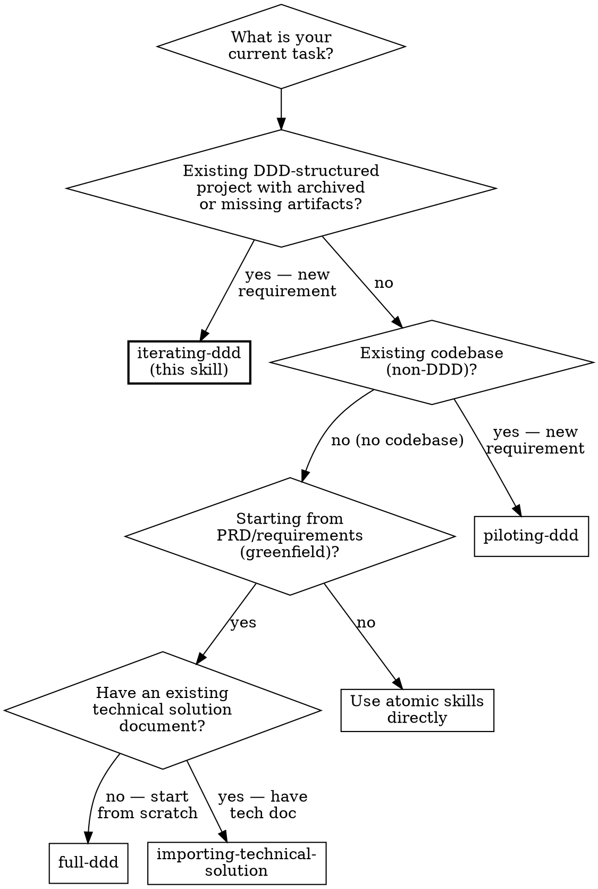

# Iterating DDD Workflow

## Overview
This skill orchestrates iterative DDD development — adding new features or requirements to an existing DDD-structured codebase. It first rebuilds the current baseline from code (via [snapshotting-code-context](../snapshotting-code-context/SKILL.md)), then routes the new requirement through only the pipeline phases that are needed.

Unlike [full-ddd](../full-ddd/SKILL.md) which runs all 5 phases from scratch, this skill evaluates what changed and executes the minimum necessary phases. It supports two routes:

- **Route B (Extend existing BC):** New requirement fits within existing Bounded Context boundaries. Steps 4 (Phase 2: Context Map), 5 (Phase 3: Contracts, conditional), and 6 (Phase 4: Tech Decisions) may be skipped.
- **Route C (Cross-domain new functionality):** New requirement crosses or creates Bounded Context boundaries. All phases execute.

**Foundational Principle:** Iteration requires a code-derived baseline — not archived documents, not memory, not assumptions about "what was there before." The snapshot is **mandatory** before any iteration work begins. Route selection is a **human decision** informed by agent analysis — the agent must not default to Route B to avoid work. There is no shortcut threshold below which the snapshot or route evaluation may be skipped. Violating the letter of the rules is violating the spirit of the rules.

**REQUIRED SUB-SKILLS:**
- [snapshotting-code-context](../snapshotting-code-context/SKILL.md) (Step 1 — baseline)
- [extracting-domain-events](../extracting-domain-events/SKILL.md) (Step 3 — new events)
- [designing-contracts-first](../designing-contracts-first/SKILL.md) (Step 5 — delta contracts)
- [architecting-technical-solution](../architecting-technical-solution/SKILL.md) (Step 6 — new context tech decisions)
- [spec-driven-development](../spec-driven-development/SKILL.md) (Step 7 — SDD Merge mode)
- [coding-isolated-domains](../coding-isolated-domains/SKILL.md) (Step 9 — implementation)
- [test-driven-development](../test-driven-development/SKILL.md) (Step 9 — coding methodology)

## When to Use


- When adding new features to an existing DDD-structured codebase.
- When `docs/ddd/` is empty (artifacts archived) and new requirements arrive.
- When the codebase already has Bounded Contexts, ports, adapters, and domain events in code.

**Do NOT use when:** starting a greenfield project from requirements (use [full-ddd](../full-ddd/SKILL.md)), importing an existing technical document into DDD format (use [importing-technical-solution](../importing-technical-solution/SKILL.md)), adding features to an existing non-DDD codebase (use [piloting-ddd](../piloting-ddd/SKILL.md)), or modifying logic within a single established Bounded Context where the context map is unchanged (use [coding-isolated-domains](../coding-isolated-domains/SKILL.md) directly — but verify `docs/ddd/phase-4-technical-solution.md` exists first).

## Quick Reference

| Step | Action | Output | Gate |
|:---|:---|:---|:---|
| 0 | Pre-flight checks | Verified empty `docs/ddd/`, DDD structure confirmed, new requirement accepted | — |
| 1 | Code snapshot | Baseline `phase-*.md` artifacts from code | Human confirms snapshot |
| 2 | Route evaluation | Route plan document (B or C) | **STOP: Human confirms route** |
| 3 | Phase 1 — extract new events | New events table (delta) | B: Human / C: Autonomous |
| 4 | Incremental Phase 2 — update Context Map | Updated context map with new/modified BCs | Autonomous (STOP/ASSUME) |
| 5 | Delta Phase 3 — new contracts | New cross-context contracts | Autonomous (STOP/ASSUME) |
| 6 | Phase 4 — new context tech decisions | 7-dimension decisions for new contexts | Autonomous (STOP/ASSUME) |
| 7 | SDD Merge — update spec files | Updated spec files + spec-manifest.md | Autonomous (STOP/ASSUME) |
| 8 | Spec Review Gate | Specs + baseline + delta + all assumptions confirmed | **Human must confirm** |
| 9 | Phase 5 — coding (TDD) | Domain code + tests for affected contexts | Human |
| 10 | Archive | `archive-artifacts.sh` moves to `archive/v{N}/` | — |

**Route B (Extend existing BC):**
```
Step 0 → 1 → 2 → 3 → [5 if new contracts needed] → [7 if contracts changed] → 8 → 9 → 10
```

**Route C (Cross-domain new functionality):**
```
Step 0 → 1 → 2 → 3 → 4 → 5 → 6 → 7 → 8 → 9 → 10
```

## Ambiguity Handling

Follow the [Ambiguity Handling Protocol](../_shared/ambiguity-handling-reference.md) throughout.

### Iteration STOP Triggers

| Ambiguity | Why STOP |
|:---|:---|
| Route B vs Route C cannot be determined from the requirement | Route selection drives which phases execute — wrong route means missing or redundant work |
| New requirement touches a BC boundary that is ambiguous in the snapshot | BC boundary changes cascade to contracts and tech decisions — must confirm before proceeding |
| Unclear whether new events belong to an existing BC or require a new one | Wrong assignment creates coupling or misses necessary contracts |
| Snapshot artifacts were rejected by human but no corrections provided | Cannot proceed with unconfirmed baseline |

### Iteration ASSUME & RECORD

| Ambiguity | Default assumption |
|:---|:---|
| New events fit naturally in an existing BC based on domain language | ASSUME they belong to the nearest BC by language affinity; record for review |
| Existing relationship pattern (e.g., ACL) still applies after adding new events | ASSUME relationship unchanged; record for verification at Spec Review Gate |
| New requirement doesn't mention a technology choice | ASSUME existing technology stack applies; record assumption |
| UL terms in new requirement match existing dictionary entries | ASSUME same meaning; record for disambiguation |

## Session Recovery

**Before starting any work**, check for an existing iteration workflow:

1. Check if `docs/ddd/ddd-progress.md` exists.
2. **If it exists:** Read `ddd-progress.md` and check `workflow_mode`. If `iterate`, resume from the first incomplete step. Run `sh skills/full-ddd/scripts/session-recovery.sh` for a quick status report.
3. **If it does not exist:** Proceed to Step 0 (Pre-flight Checks).

**Persisted artifacts contain human-approved decisions and are authoritative.** Do not discard or re-do completed steps unless the user explicitly requests it.

## Implementation (Interactive Orchestration)

**CRITICAL RULE:** You are the orchestrator. The code snapshot (Step 1) and route evaluation (Step 2) are **mandatory** — never skip them. Route selection is a **human decision** — never default to Route B to minimize work. The Spec Review Gate (Step 8) is a **mandatory hard stop** — never bypass it.

### Step 0: Pre-flight Checks

1. **Check `docs/ddd/` state:**
   - If `phase-*.md` files exist → STOP: "Current artifacts exist. Are these up to date, or should I rebuild from code?"
   - If `docs/ddd/` is empty or absent → proceed.
2. **Verify DDD structure:** Glob scan for domain directories (`internal/biz/`, `internal/domain/`, `src/*/domain/`, or similar). If no DDD structure found → STOP: "This project doesn't appear to have DDD structure. Consider [piloting-ddd](../piloting-ddd/SKILL.md) for brownfield DDD introduction (existing non-DDD codebase), or [full-ddd](../full-ddd/SKILL.md) for greenfield from PRD."
3. **Accept new requirement:** Ask the user to provide the new requirement (PRD, feature spec, or description).
4. **Initialize progress tracker:** Create `docs/ddd/ddd-progress.md` from the iteration template (`skills/iterating-ddd/templates/ddd-progress-iterate.md`).

### Step 1: Code Snapshot → `snapshotting-code-context`

Execute [snapshotting-code-context](../snapshotting-code-context/SKILL.md) to rebuild baseline artifacts from the current code.

**Gate:** Human must confirm the snapshot artifacts before proceeding.

After confirmation, update `ddd-progress.md`: snapshot status = complete.

### Step 2: Route Evaluation

Compare the new requirement against the baseline artifacts to determine the iteration route.

**Evaluate these 4 questions:**

| # | Question | Route B Signal | Route C Signal |
|:---|:---|:---|:---|
| 1 | Does the requirement introduce a new Bounded Context? | No — fits in existing BC | Yes — new BC needed |
| 2 | Does the requirement change BC boundaries? | No — boundaries unchanged | Yes — split, merge, or new |
| 3 | Does the requirement introduce new cross-context communication? | No — or only within existing contracts | Yes — new contracts needed between existing or new BCs |
| 4 | Does the requirement need new technology decisions? | No — existing stack applies | Yes — new BC needs own tech decisions |

**Produce a route plan** using the template (`skills/iterating-ddd/templates/route-plan.md`).

**STOP — present the route plan to the human:**

**Checkpoint:** "Based on my analysis, I recommend **Route [B/C]**. Here is the route plan with my reasoning for each question. Do you agree with this route?"

The human may override. If the human chooses a different route, update the plan and proceed with their choice.

Persist the route plan to `docs/ddd/route-plan.md`. Update `ddd-progress.md`.

### Step 3: Phase 1 → `extracting-domain-events` (New Events Only)

Execute [extracting-domain-events](../extracting-domain-events/SKILL.md) scoped to the **new requirement only**.

**Important:** Present the baseline events table (from snapshot) alongside the new events. The human must see both to evaluate completeness.

**Gate:**
- **Route B:** Human approval (interactive checkpoint) — the human confirms the delta events. Route B skips Phase 2 (Context Map) and Phase 4 (Tech Decisions). Phase 3 (Contracts) runs only if new cross-context communication is identified. This checkpoint plus the Spec Review Gate (Step 8) are Route B's design review gates.
- **Route C:** Autonomous Mode — apply STOP/ASSUME protocol. Persist immediately. Route C has full Phase 2-6 pipeline with its own review gates downstream.

Persist delta events: append new events to `docs/ddd/phase-1-domain-events.md` (clearly marked as `[ITERATION: v{N+1}]`). Update `ddd-progress.md`.

### Step 4: Incremental Phase 2 — Update Context Map

**Only execute for Route C.** Route B skips this step.

Using the baseline Context Map (from snapshot) and new events (from Step 3):

1. **Display the baseline Context Map** — show existing BCs, classifications, relationships.
2. **Display the new events** — highlight which don't fit in any existing BC.
3. **Ask:** "Which existing BC do these new events belong to? Or do we need a new BC?"
4. **For new BCs:**
   - Propose boundary, strategic classification, and relationships to existing BCs.
   - Reference [mapping-bounded-contexts](../mapping-bounded-contexts/SKILL.md) classification criteria (Core/Supporting/Generic) and relationship patterns (ACL, OHS, Shared Kernel, etc.) — apply the principles inline, do not invoke the skill as a sub-step.
   - Build UL dictionary for the new BC.
5. **For existing BCs receiving new events:**
   - Update the event list in the Context Map.
   - Check if UL needs new terms.
   - Check if existing relationships changed (new upstream/downstream dependencies).
6. **Check relationship integrity:** Do new events create new cross-context dependencies?

Apply STOP/ASSUME protocol throughout. Persist updated `docs/ddd/phase-2-context-map.md` immediately. Update `ddd-progress.md`.

### Step 5: Delta Phase 3 — New Contracts

**Route B:** Execute only if the new requirement introduces new cross-context communication not covered by existing contracts. Skip if all communication stays within existing contract boundaries.

**Route C:** Always execute.

For each new cross-context interaction identified in Step 4 (or Step 3 for Route B):

1. Draft the interface contract following [designing-contracts-first](../designing-contracts-first/SKILL.md) principles.
2. Define boundary structs for the new interaction.
3. Specify sync vs async, data shapes, and error contracts.

Apply STOP/ASSUME protocol. Persist new contracts: append to `docs/ddd/phase-3-contracts.md` (clearly marked as `[ITERATION: v{N+1}]`). Update `ddd-progress.md`.

### Step 6: Phase 4 — New Context Tech Decisions

**Only execute for Route C when a new Bounded Context was created in Step 4.**

Route B and Route C without new BCs skip this step.

For each **new** BC only:
1. Walk all 7 technical dimensions following [architecting-technical-solution](../architecting-technical-solution/SKILL.md).
2. Depth level based on strategic classification (Core = Full RFC, Supporting = Medium, Generic = Lightweight).
3. Reference existing BCs' tech decisions for consistency where appropriate, but do not blindly copy.

Apply STOP/ASSUME protocol. Persist new tech decisions: append to `docs/ddd/phase-4-technical-solution.md` (clearly marked as `[ITERATION: v{N+1}]`). Update `ddd-progress.md`.

### Step 7: SDD Merge → `spec-driven-development` (Autonomous Mode)

**Condition:** Run if any contracts changed in Steps 3-5 (new events, updated context map, new contracts, or new tech decisions). Route B skips this step if no new contracts were added.

Execute [spec-driven-development](../spec-driven-development/SKILL.md). The skill auto-detects mode:
- If `specs/` exists with files → **Merge mode**: THREE-WAY DIFF merges contract changes into existing spec files, preserving human edits.
- If `specs/` is empty or absent → **Generate mode**: Create spec files from scratch.

Apply Ambiguity Handling Protocol: STOP for three-way merge conflicts and breaking changes; ASSUME & RECORD for syntax version and error naming. **Write updated spec files to `specs/` and update `docs/ddd/spec-manifest.md` immediately. Do NOT wait for human approval.** Proceed to Spec Review Gate.

### Step 8: Spec Review Gate

**MANDATORY hard stop before any coding begins.**

1. Present to the developer:
   - **Baseline summary** (from snapshot — what existed before)
   - **Delta summary** (what was added/changed in this iteration)
   - **Route plan** (which phases ran and why)
   - `docs/ddd/spec-manifest.md` (coverage table + error completeness)
   - Key updated spec files from `specs/` (affected aggregates)
   - `docs/ddd/assumptions-draft.md` (full contents — all accumulated ASSUME entries)
2. Developer reviews each `[ASSUMPTION]` entry: ✅ Keep | ✏️ Revise
3. For any REVISED entry: check if the revision affects an upstream artifact. If so, update that artifact. If it affects spec files, re-run SDD Merge on the affected aggregates.
4. Once all entries confirmed: append to `docs/ddd/decisions-log.md` with status CONFIRMED or REVISED. Delete `docs/ddd/assumptions-draft.md`.
5. **Only after explicit developer approval → proceed to Step 9.**

**Checkpoint:** "The Spec Review Gate is complete. Baseline + delta + specs are confirmed. Shall I proceed to Phase 5 (domain coding with TDD) for the affected contexts?"

### Step 9: Phase 5 → `coding-isolated-domains` + `test-driven-development` (Affected Contexts Only)

Use [test-driven-development](../test-driven-development/SKILL.md) to drive implementation for **only the Bounded Contexts affected by this iteration**:

- **Route B:** The single BC that received new events/logic.
- **Route C:** New BCs + any existing BCs whose contracts changed.

TDD entry check (spec hash validation) runs automatically — if spec hashes changed, TDD triggers RECONCILE before starting new tests. Do NOT re-implement unchanged BCs.

**Checkpoint** at each sub-step per the coding skill's own interactive model.

### Step 10: Archive

**PIPELINE COMPLETE.** All iteration steps executed and artifacts persisted in `docs/ddd/`.

**Archive this iteration:**
```
sh skills/full-ddd/scripts/archive-artifacts.sh
```
This moves all phase artifacts and `ddd-progress.md` into `docs/ddd/archive/v{N}/`. The `docs/ddd/` directory is left clean for the next iteration.

For the next iteration, use this skill ([iterating-ddd](../iterating-ddd/SKILL.md)) again — it will rebuild the baseline from the updated code.

## Phase Transition Rules

| Transition | Required Input | Gate | Persistence |
|:---|:---|:---|:---|
| Start → Step 0 | New requirement text | — | Create `docs/ddd/` + `ddd-progress.md` (iterate template) |
| Step 0 → Step 1 | DDD structure confirmed | — | — |
| Step 1 → Step 2 | Human-confirmed snapshot artifacts | Human confirms snapshot | All `phase-*.md` files written |
| Step 2 → Step 3 | Human-confirmed route plan | **Human confirms route** | Write `docs/ddd/route-plan.md` |
| Step 3 → Step 4/5/7 | New events extracted | Route B: Human / Route C: Autonomous | Append to `phase-1-domain-events.md` |
| Step 4 → Step 5 | Updated Context Map (Route C only) | Autonomous (STOP/ASSUME) | Update `phase-2-context-map.md` |
| Step 5 → Step 6/7 | New contracts (if applicable) | Autonomous (STOP/ASSUME) | Append to `phase-3-contracts.md` |
| Step 6 → Step 7 | New context tech decisions (Route C with new BC only) | Autonomous (STOP/ASSUME) | Append to `phase-4-technical-solution.md` |
| Step 7 → Step 8 | Updated spec files (if contracts changed) | Autonomous (STOP/ASSUME) | Update spec files in `specs/` + update `docs/ddd/spec-manifest.md` |
| Step 8 → Step 9 | Confirmed assumptions + approved specs + delta | **Human must approve** | Append to `decisions-log.md`, delete `assumptions-draft.md` |
| Step 9 → Step 10 | Code + tests approved | Human | Update `ddd-progress.md` status = complete |
| Step 10 | — | — | Run `archive-artifacts.sh` |

**Persistence is MANDATORY at every step gate.** Write the approved deliverable to the corresponding file in `docs/ddd/` BEFORE starting the next step.

## Self-Check Protocol

Follow the [Persistence Defense Reference](../_shared/persistence-defense-reference.md) at every step gate, with these context-specific items:

4. **Snapshot Artifacts Exist:** After Step 1, verify all `docs/ddd/phase-*.md` files exist.

5. **Route Plan Persisted:** After Step 2, verify `docs/ddd/route-plan.md` exists and contains the confirmed route.

6. **SDD Artifacts Exist:** After Step 7 (if it ran), verify `docs/ddd/spec-manifest.md` exists and `specs/` contains updated spec files for the affected aggregates.

7. **Assumptions Draft Persisted:** If any ASSUME & RECORD decisions were made, verify `docs/ddd/assumptions-draft.md` exists and contains the entries.

8. **Archive Completed:** After Step 10 and `archive-artifacts.sh` runs, verify `docs/ddd/ddd-progress.md` no longer exists. If it still exists, the archive did not run — run it before ending the session.

See [Persistence Defense Reference](../_shared/persistence-defense-reference.md) for platform-specific hooks configuration and the three-layer defense model.

## End-to-End Example

For a complete walkthrough demonstrating Route C (adding Returns & Refunds to an e-commerce project), see [example-iterate.md](example-iterate.md).

## Rationalization Table

These are real excuses agents use to bypass the iteration workflow. Every one of them is wrong.

| Excuse | Reality |
|:---|:---|
| "This is a small feature — just run full-ddd or skip to coding" | Small features in existing DDD projects need iteration, not greenfield. full-ddd would ignore the existing context map and create redundant work. |
| "I'll skip the code snapshot — I remember the project structure" | Agent memory is unreliable across sessions. Code is the only authoritative baseline. The snapshot is mandatory. |
| "This clearly fits in the existing BC — default to Route B" | Route selection is a human decision. "Clearly fits" is an agent judgment that may miss new BC boundaries. Present analysis, let human decide. |
| "Route C is overkill — the requirement only touches two BCs" | Touching two BCs IS cross-domain by definition. If new contracts or BC changes are needed, Route C applies. |
| "I'll read the archived artifacts as a faster baseline" | Archived artifacts may not reflect current code. The archive is a human record, not agent input. The snapshot reads code, not documents. |
| "The Spec Review Gate isn't needed — only one assumption was made" | The Spec Review Gate surfaces ALL accumulated decisions (assumptions + baseline + delta) in one view. The count of assumptions doesn't determine whether review is needed. |
| "I'll re-implement all BCs to ensure consistency" | Only affected BCs need implementation. Re-implementing unchanged BCs wastes effort and risks introducing regressions. |
| "Phase 2 update isn't needed — I'll just add events to the existing map" | Adding events without evaluating BC boundaries, classifications, and relationships means the Context Map may become inconsistent. The incremental Phase 2 evaluation is the check. |
| "Skip SDD Merge — the existing spec files are close enough" | "Close enough" is a hallucination entry point. New contracts must be merged into spec files via three-way diff. Skipping silently drops contract changes from the spec baseline. |
| "SDD Merge isn't needed for Route B small changes" | Route B only skips SDD if NO contracts changed. Any new contract, even a single field addition, requires SDD Merge to update spec files and hashes. |

## Red Flags — STOP and Follow the Iteration Pipeline

If you catch yourself thinking "just run full-ddd instead", "I remember the project", "obviously Route B", "skip the snapshot", "read the archive for speed", "one assumption doesn't need a gate", "re-implement everything for safety", "just add events without updating the map", "skip SDD Merge — specs are fine", or "skip the Spec Review Gate" — **STOP. Run the snapshot. Evaluate the route. Let the human decide. Execute only affected phases. Run SDD Merge when contracts change. Persist at every gate. Present the Spec Review. Archive on completion. No exceptions.**
