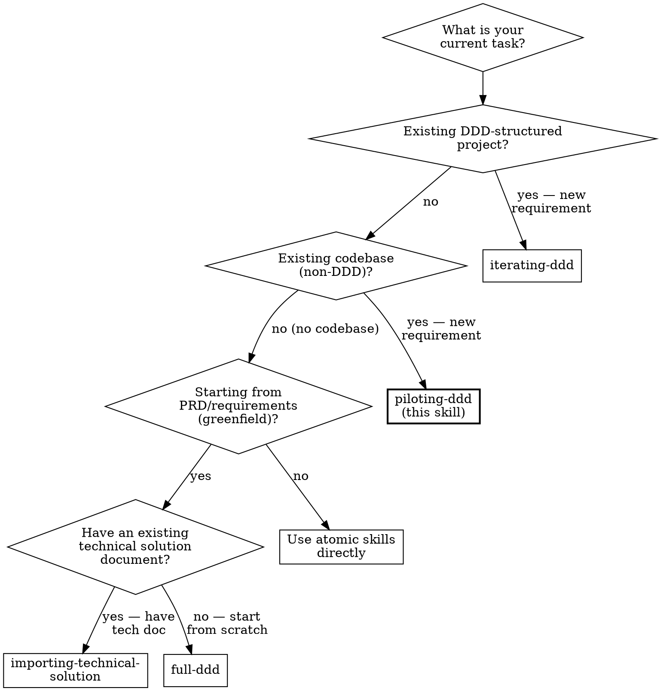

# Piloting DDD Workflow

## Overview

This skill orchestrates brownfield DDD introduction — adding a clean DDD "island" alongside existing non-DDD legacy code. It first maps the legacy landscape (via [mapping-legacy-landscape](../mapping-legacy-landscape/SKILL.md)), then analyzes the requirement's impact on legacy code, proposes DDD island boundaries with ACL adapters, and executes the DDD pipeline for the new island only.

Unlike [full-ddd](../full-ddd/SKILL.md) which starts from a PRD on a greenfield codebase, this skill respects existing code and builds DDD alongside it. Unlike [iterating-ddd](../iterating-ddd/SKILL.md) which extends an existing DDD codebase, this skill introduces DDD where none existed.

Two routes:

- **Route A (Full DDD Island):** Creates a complete Bounded Context with all 5 phases.
- **Route D (Disciplined Extension):** Adds clean code with ACL contracts but without full BC ceremony.

**Foundational Principle:** Legacy code gets minimal touch (additive only, never modify existing logic). The DDD island is built clean. ACL adapters are the mandatory bridge — never skip them, never let legacy concepts leak into the domain. Route selection is a **human decision** — the agent must not recommend Route D to minimize work. There is no simplicity threshold below which the landscape scan, impact analysis, or ACL may be skipped. Violating the letter of the rules is violating the spirit of the rules.

**REQUIRED SUB-SKILLS:**
- [mapping-legacy-landscape](../mapping-legacy-landscape/SKILL.md) (Step 1 — landscape)
- [extracting-domain-events](../extracting-domain-events/SKILL.md) (Step 5 — events)
- [designing-contracts-first](../designing-contracts-first/SKILL.md) (Step 7 — ACL contracts)
- [architecting-technical-solution](../architecting-technical-solution/SKILL.md) (Step 8 — tech decisions)
- [spec-driven-development](../spec-driven-development/SKILL.md) (Step 9 — generate spec files)
- [coding-isolated-domains](../coding-isolated-domains/SKILL.md) (Step 12 — implementation)
- [test-driven-development](../test-driven-development/SKILL.md) (Step 12 — coding methodology)

## When to Use


- When adding new features to an existing non-DDD codebase (legacy, monolith, 屎山).
- When introducing DDD for the first time in a project that has no DDD structure.
- When the codebase uses MVC, layered, or no discernible architecture pattern.

**Do NOT use when:** the project already has DDD structure (use [iterating-ddd](../iterating-ddd/SKILL.md)), starting from scratch with no existing code (use [full-ddd](../full-ddd/SKILL.md)), or importing an existing technical document (use [importing-technical-solution](../importing-technical-solution/SKILL.md)).

## Quick Reference

| Step | Action | Output | Gate |
|:---|:---|:---|:---|
| 0 | Pre-flight checks (confirm non-DDD, has code, accept requirement) | Confirmed status | — |
| 1 | Legacy landscape mapping → `mapping-legacy-landscape` | `legacy-landscape.md` | Human confirms landscape |
| 2 | Impact analysis + interaction type classification | `impact-analysis.md` (with Interaction Types) | Autonomous; MODIFY ≥ 1 → STOP |
| 3 | Boundary proposal + Legacy Touch Register | `boundary-proposal.md` (ACL directions + legacy touch list) | **STOP: Human confirms boundary + legacy changes** |
| 4 | **Scope Gate** (Route A: full island / Route D: disciplined extension) | Scope decision | **STOP: Human chooses** |
| 5 | Phase 1 → `extracting-domain-events` (new requirement only) | Events table | A: Human / D: Autonomous |
| 6 | Minimal Phase 2 — define new BC + relationships to legacy | Context Map (minimal version) | Autonomous (STOP/ASSUME) |
| 7 | Phase 3 → `designing-contracts-first` (ACL contracts focus) | ACL port interfaces + Legacy Adapter Specs | Autonomous (STOP/ASSUME) |
| 8 | Phase 4 → `architecting-technical-solution` (DDD island only) | 7-dimension decisions (with legacy tech constraints) | Autonomous (STOP/ASSUME) |
| 9 | SDD → spec-driven-development (Generate mode) | Spec files + spec-manifest.md | Autonomous (STOP/ASSUME) |
| 10 | **Spec Review Gate** | Full presentation: landscape + impact + boundary + design + specs + assumptions | **Human must confirm** |
| 11 | **Project Init Gate** — developer runs code generators, pins remote deps, sets up project scaffold | Compilable project scaffold + finalized go.mod | **Human confirmation** |
| 12 | Phase 5 → `coding-isolated-domains` + `test-driven-development` + ACL adapters | Domain code + tests + ACL adapter code | Human |
| 13 | Archive | `archive-artifacts.sh` | — |

**Route A (Full DDD Island):**
```
Step 0 → 1 → 2 → 3 → 4 → 5 → 6 → 7 → 8 → 9 → 10 → 11 → 12 → 13
```

**Route D (Disciplined Extension):**
```
Step 0 → 1 → 2 → 3 → 4 → 5(minimal) → [skip 6] → 7(ACL-only) → [skip 8] → 9 → 10 → 11 → 12(extension) → 13
```

## Ambiguity Handling

Follow the [Ambiguity Handling Protocol](../_shared/ambiguity-handling-reference.md) throughout.

### Pilot STOP Triggers

| Ambiguity | Why STOP |
|:---|:---|
| Impact analysis reveals MODIFY interaction type — legacy behavior change has high blast radius | Changing existing legacy behavior is the opposite of Strangler Fig — must confirm before proceeding |
| Cannot determine DDD island boundary — unclear which behavior is "new" vs "existing" | Wrong boundary creates coupling or misplaces responsibility — the island must have a clear perimeter |
| ACL direction unclear — cannot tell if legacy needs to call island or vice versa | ACL direction determines integration mechanism and which side owns the adapter — wrong direction means wrong architecture |
| Legacy code has no natural seams — ACL attachment requires invasive changes | Invasive changes violate the additive-only principle — must discuss alternatives with the human |
| Requirement scope overlaps significantly with existing legacy functionality — may need larger refactor than pilot | Overlap means the pilot may not be the right approach — the human must decide between pilot, refactor, or phased migration |
| Shared domain concept has different semantics in legacy vs new requirement — translation rules ambiguous | Semantic mismatch in shared concepts creates subtle bugs — translation rules must be explicit and human-confirmed |

### Pilot ASSUME & RECORD

| Ambiguity | Default assumption |
|:---|:---|
| Legacy technology stack applies to DDD island deployment (same DB, same framework) | ASSUME same stack; record for Phase 4 review |
| Existing legacy API patterns (REST, JSON) apply to island's external interfaces | ASSUME same pattern; record assumption |
| Legacy integration points remain stable during pilot | ASSUME no concurrent legacy changes; record risk |
| Shared concepts use the legacy name as alias in the translation table | ASSUME legacy name is well-understood; record for UL review |

## Session Recovery

**Before starting any work**, check for an existing pilot workflow:

1. Check if `docs/ddd/ddd-progress.md` exists.
2. **If it exists:** Read `ddd-progress.md` and check `workflow_mode`. If `pilot`, resume from the first incomplete step. Run `sh skills/full-ddd/scripts/session-recovery.sh` for a quick status report.
3. **If it does not exist:** Proceed to Step 0 (Pre-flight Checks).

**Persisted artifacts contain human-approved decisions and are authoritative.** Do not discard or re-do completed steps unless the user explicitly requests it.

## Implementation (Interactive Orchestration)

**CRITICAL RULE:** You are the orchestrator. The legacy landscape mapping (Step 1) and impact analysis (Step 2) are **mandatory** — never skip them. Route selection is a **human decision** — never default to Route D to minimize work. The Spec Review Gate (Step 10) is a **mandatory hard stop** — never bypass it.

### Step 0: Pre-flight Checks

1. **Check `docs/ddd/` state:** If `phase-*.md` files exist → STOP: "Current artifacts exist. Are these up to date, or should I proceed with a fresh pilot?"
2. **Verify NON-DDD structure:** Glob scan for domain directories (`internal/biz/`, `internal/domain/`, `src/*/domain/`, or similar). If DDD structure IS found → STOP: "This project appears to have DDD structure. Consider [iterating-ddd](../iterating-ddd/SKILL.md) instead." If no DDD but has code → proceed.
3. **Accept new requirement** from the human.
4. **Initialize progress tracker:** Create `docs/ddd/ddd-progress.md` from the pilot template (`skills/piloting-ddd/templates/ddd-progress-pilot.md`).

### Step 1: Legacy Landscape Mapping → `mapping-legacy-landscape`

Execute [mapping-legacy-landscape](../mapping-legacy-landscape/SKILL.md) to produce the legacy landscape map.

**Gate:** Human must confirm the landscape map before proceeding.

After confirmation, update `ddd-progress.md`: landscape status = complete.

### Step 2: Impact Analysis + Interaction Type Classification

Analyze how the new requirement interacts with the legacy code identified in the landscape map.

For each legacy component touched by the requirement:

1. Identify the component (entity, service, table, integration).
2. Classify the **Interaction Type**:
   - `READ` — Island queries legacy data (Outbound, no legacy touch)
   - `WRITE` — Island writes to legacy system (Outbound, no legacy touch)
   - `HOOK` — Legacy code needs to trigger island behavior (Inbound, requires additive legacy change)
   - `SHARED` — Same domain concept exists in both systems (Bidirectional, requires translation layer)
   - `MODIFY` — New requirement changes legacy behavior (Bidirectional, requires delegate/decorator point)
3. Assess risk level for each interaction.
4. Produce **Interaction Direction Summary**: Outbound N / Inbound M / Bidirectional K.

**If ANY MODIFY interaction is found → STOP:** "The requirement involves changing existing legacy behavior at [locations]. This has high blast radius. Please confirm: (a) the behavior change is correct, (b) the additive approach (delegate/decorator) is acceptable."

Persist to `docs/ddd/impact-analysis.md`. Update `ddd-progress.md`.

### Step 3: Boundary Proposal + Legacy Touch Register

Based on the landscape map and impact analysis:

1. **Propose the DDD Island boundary:** name, responsibility, entities, behaviors.
2. **Define ACL boundaries** for each legacy interaction point:
   - Direction: Outbound / Inbound / Bidirectional
   - Integration Mechanism: DB adapter / API client / Event listener / CDC / Polling / Decorator
   - Translation complexity: Simple / Moderate / Complex
3. **Minimal Legacy Touch Register** (only for HOOK/MODIFY interactions):
   - Legacy file and line
   - Touch type: ADD hook / ADD emit / ADD callback / ADD facade method
   - Description of what to add
   - Confirmation that existing behavior is unchanged
   - Risk level
4. **Shared Concept Translation Table** (only for SHARED interactions):
   - Legacy name ↔ DDD name
   - Translation rules
   - Semantic differences
5. **Non-Touch Zone:** explicitly list legacy areas that will NOT be changed.
6. **Architecture Sketch:** ASCII diagram showing DDD island + Outbound ACL + Inbound ACL + Legacy.
7. **Scope Assessment:** metrics including MODIFY count, HOOK count, total interaction points.

**STOP — present the complete boundary proposal:**

**Checkpoint:** "Here is the proposed DDD island boundary, ACL design, and legacy touch points. Please review, especially the Legacy Touch Register (items requiring legacy code changes)."

Persist to `docs/ddd/boundary-proposal.md`. Update `ddd-progress.md`.

### Step 4: Scope Gate

Present the scope decision to the human. This follows the same pattern as [full-ddd](../full-ddd/SKILL.md)'s Exit Gate.

Present Route A vs Route D with the assessment data from Steps 2-3:
- Interaction complexity summary (MODIFY count, HOOK count)
- Island scope size (entities, behaviors)
- ACL surface area

**Rules:**
- Agent MUST NOT recommend Route D — present data neutrally
- Agent MUST NOT add commentary like "this feature is simple enough for Route D"
- Only the human can choose Route D — Agent defaults to Route A
- If MODIFY count ≥ 3 → display explicit warning: "MODIFY interactions are numerous — pilot scope may be too large. Consider phased implementation or more systematic refactoring."

Route D skips Step 6 (BC definition) and Step 8 (tech decisions). Step 7 produces ACL contracts only.

**STOP — present scope decision:**

**Checkpoint:** "Based on the analysis: [data]. Route A creates a full DDD Bounded Context. Route D creates a disciplined extension with ACL contracts. Which approach would you like?"

Update `ddd-progress.md` with scope decision.

### Step 5: Phase 1 → `extracting-domain-events` (New Requirement Only)

Execute [extracting-domain-events](../extracting-domain-events/SKILL.md) scoped to the **new requirement only**.

**Gate:**
- **Route A:** Human approval (interactive checkpoint).
- **Route D:** Autonomous Mode (minimal events, STOP/ASSUME protocol).

Persist to `docs/ddd/phase-1-domain-events.md`. Update `ddd-progress.md`.

### Step 6: Minimal Phase 2 — Define New BC + Relationships to Legacy

**Only execute for Route A.** Route D skips this step.

Unlike a full Phase 2 that maps all BCs, this step only defines:

1. **The new DDD island BC:** boundary, strategic classification, UL dictionary.
2. **Its relationships to legacy:** ACL relationship with each legacy interaction point.
3. Reference [mapping-bounded-contexts](../mapping-bounded-contexts/SKILL.md) classification criteria (Core/Supporting/Generic) and relationship patterns — apply inline, do not invoke as sub-step.

Apply STOP/ASSUME protocol. Persist to `docs/ddd/phase-2-context-map.md`. Update `ddd-progress.md`.

### Step 7: Phase 3 → `designing-contracts-first` (ACL Contracts Focus)

Execute [designing-contracts-first](../designing-contracts-first/SKILL.md) with brownfield extensions.

Standard Phase 3 designs contracts between DDD contexts. Here, contracts are between the DDD island and legacy code, split into:

**Outbound ACL (island → legacy) — each contract includes Legacy Adapter Specification:**
- Legacy DB adapter: tables/queries, column-to-domain field mapping
- Legacy API adapter: endpoints, request/response mapping
- Legacy Service adapter: methods, parameter mapping
- Error mapping: legacy errors → domain errors

**Inbound ACL (legacy → island) — when HOOK/SHARED/MODIFY interactions exist:**
- Inbound Port: DDD island port interface (uses domain language)
- Legacy Hook Specification: what to add in legacy code (emit/callback)
- Integration Mechanism: Event (async) / Callback (sync) / CDC / Polling
- Shared Concept Translation Table (when SHARED interaction)

**Boundary Challenge (3 questions):**
1. "Does this contract leak legacy concepts into the DDD domain? Does the port interface use legacy-specific terminology, data shapes, or error types?"
2. "Does the Inbound contract require legacy code changes? Are those changes additive only?"
3. "Is the Shared concept translation complete? Are there fields that lose semantics in translation?"

Apply STOP/ASSUME protocol. Persist to `docs/ddd/phase-3-contracts.md`. Update `ddd-progress.md`.

### Step 8: Phase 4 → `architecting-technical-solution` (DDD Island Only)

**Only execute for Route A.** Route D skips this step.

Execute [architecting-technical-solution](../architecting-technical-solution/SKILL.md) for the DDD island BC only, with brownfield considerations:

- **Dim 1 (Persistence):** Can the island use a separate schema in the same database?
- **Dim 2 (Interface):** Does the island API need to be compatible with legacy patterns?
- **Dim 4 (External deps):** Legacy system itself is an external dependency, wrapped via ACL.
- **Dim 7 (Testing):** Integration tests MUST cover ACL adapter interaction with legacy code.

Apply STOP/ASSUME protocol. Persist to `docs/ddd/phase-4-technical-solution.md`. Update `ddd-progress.md`.

### Step 9: SDD → `spec-driven-development` (Autonomous Mode)

Generate formal spec files for the DDD island from Step 7 ACL contracts + Step 8 tech decisions. Execute [spec-driven-development](../spec-driven-development/SKILL.md) in Generate mode (first pilot of this island has no existing spec files).

- **Route A:** Full spec generation from Phase 3 contracts + Phase 4 tech decisions.
- **Route D:** ACL-focused spec generation from Step 7 ACL contracts; tech format assumed from legacy stack (record assumption).

Apply Ambiguity Handling Protocol: STOP for protocol conflicts and breaking changes; ASSUME & RECORD for syntax version and error naming. **Write spec files to `specs/` and persist `docs/ddd/spec-manifest.md` immediately. Do NOT wait for human approval.** Proceed to Spec Review Gate.

### Step 10: Spec Review Gate

**MANDATORY hard stop before any coding begins.**

Present to the developer:

1. **Legacy landscape summary** (from Step 1)
2. **Impact analysis with interaction types** (from Step 2)
3. **Boundary proposal + Legacy Touch Register** (from Step 3)
4. **Scope decision and rationale** (from Step 4)
5. **Design artifacts** (events, context map if Route A, contracts, tech decisions if Route A)
6. `docs/ddd/spec-manifest.md` (coverage table + error completeness for ACL and island interfaces)
7. Key spec files from `specs/` (ACL interface sample)
8. `docs/ddd/assumptions-draft.md` (all accumulated ASSUME entries)

Developer reviews each `[ASSUMPTION]`: ✅ Keep | ✏️ Revise.
For REVISED entries, check upstream artifact impact. If spec files affected, re-run SDD.
Append to `docs/ddd/decisions-log.md`. Delete `docs/ddd/assumptions-draft.md`.

**Only after explicit developer approval → proceed to Project Init Gate.**

**Checkpoint:** "The Spec Review Gate is complete. Landscape + impact + boundary + design + specs are confirmed. Before I start coding, please complete project initialization."

### Step 11: Project Init Gate

**MANDATORY human checkpoint before any domain coding begins.**

Spec files are confirmed and ready. Before the agent writes domain code and ACL adapters, the developer sets up the project scaffold — installing remote generated-code packages, pinning dependencies, and running local code generators.

**Developer checklist (reference `docs/ddd/phase-4-technical-solution.md` for what applies to this project):**

1. **Install generated dependencies** — ensure remote generated-code packages are published (e.g., push proto definitions → CI runs `protoc` → published to private pb-go repo), then `go get` them into the project.
2. **Pin not-yet-used dependencies** — create `tools.go` with `//go:build tools` and blank imports for packages that Phase 5 domain code won't import but adapters will need later (e.g., proto-go types). This prevents `go mod tidy` from removing them before adapter code is written.
3. **Run local code generators and project setup** — `gorm-gen` (reads DB DDL), `sqlc`, DB schema migration, `go mod tidy`, directory structure, config templates, and any other scaffolding indicated by the technical solution.

**Checkpoint:** "Spec Review is complete. Please set up the project scaffold — install dependencies, pin future adapter imports via `tools.go`, run code generators — as indicated by `docs/ddd/phase-4-technical-solution.md`. Reply **'ready for Phase 5'** when done."

**Gate Rules:**
- Agent MUST NOT run code generators autonomously — these depend on developer environment and toolchain configuration.
- Agent MUST wait for explicit "ready for Phase 5" confirmation before starting `coding-isolated-domains`.
- If developers encounter compilation errors or spec issues during this gate (e.g., `protoc` fails on a proto file), agent SHOULD assist debugging. If the fix requires spec changes, re-run SDD Merge mode on the affected spec files and re-present for review.

### Step 12: Phase 5 → `coding-isolated-domains` + `test-driven-development` + ACL Adapters

Use [test-driven-development](../test-driven-development/SKILL.md) to drive domain code implementation for the DDD island, grounded in the spec files from Step 9. Follow [coding-isolated-domains](../coding-isolated-domains/SKILL.md) architecture constraints throughout.

**Additionally (unique to piloting-ddd):** Implement ACL adapter code:
- Outbound adapters wrapping legacy DB/API/Service access
- Inbound adapters receiving legacy hooks/events
- Shared concept translators

For HOOK/MODIFY interactions: implement the minimal legacy code additions documented in the Legacy Touch Register:
- Each addition must match EXACTLY what was approved in Step 3
- Additive only — no modifications to existing legacy logic
- Each addition gets a code comment: `// DDD Island integration point — see docs/ddd/boundary-proposal.md`

**Checkpoint** at each sub-step per the coding skill's own interactive model.

### Step 13: Archive

**PIPELINE COMPLETE.** All pilot steps executed and artifacts persisted in `docs/ddd/`.

**Archive this pilot:**
```
sh skills/full-ddd/scripts/archive-artifacts.sh
```
This moves all phase artifacts and `ddd-progress.md` into `docs/ddd/archive/v{N}/`. The `docs/ddd/` directory is left clean for the next iteration. Spec files in `specs/` are NOT archived — they remain active for the next iteration's SDD Merge mode.

For the next iteration of the DDD island, use [iterating-ddd](../iterating-ddd/SKILL.md) — the island now has DDD structure that [snapshotting-code-context](../snapshotting-code-context/SKILL.md) can read, and spec files in `specs/` will trigger SDD Merge mode.

## Phase Transition Rules

| Transition | Required Input | Gate | Persistence |
|:---|:---|:---|:---|
| Start → Step 0 | New requirement text | — | Create `docs/ddd/` + `ddd-progress.md` (pilot template) |
| Step 0 → Step 1 | Non-DDD structure confirmed, requirement accepted | — | — |
| Step 1 → Step 2 | Human-confirmed legacy landscape | Human confirms landscape | Write `docs/ddd/legacy-landscape.md` |
| Step 2 → Step 3 | Impact analysis complete | Autonomous; MODIFY ≥ 1 → STOP | Write `docs/ddd/impact-analysis.md` |
| Step 3 → Step 4 | Human-confirmed boundary proposal | **Human confirms boundary + legacy touches** | Write `docs/ddd/boundary-proposal.md` |
| Step 4 → Step 5 | Human scope decision (Route A or D) | **Human chooses scope** | Update `ddd-progress.md` scope |
| Step 5 → Step 6/7 | New events extracted | A: Human / D: Autonomous | Write `docs/ddd/phase-1-domain-events.md` |
| Step 6 → Step 7 | Context Map defined (Route A only) | Autonomous (STOP/ASSUME) | Write `docs/ddd/phase-2-context-map.md` |
| Step 7 → Step 8/9 | ACL contracts defined | Autonomous (STOP/ASSUME) | Write `docs/ddd/phase-3-contracts.md` |
| Step 8 → Step 9 | Tech decisions (Route A only) | Autonomous (STOP/ASSUME) | Write `docs/ddd/phase-4-technical-solution.md` |
| Step 9 → Step 10 | Generated spec files | Autonomous (STOP/ASSUME) | Write spec files to `specs/` + write `docs/ddd/spec-manifest.md` |
| Step 10 → Step 11 | All assumptions reviewed + specs confirmed, developer approves | **Human must approve** | Append to `decisions-log.md`, delete `assumptions-draft.md` |
| Step 11 → Step 12 | Project scaffold ready (generators run, deps pinned) | User says "ready for Phase 5" | — (developer-side work, no agent artifacts) |
| Step 12 → Step 13 | Code + tests + ACL adapters approved | Human | Update `ddd-progress.md` status = complete |
| Step 13 | — | — | Run `archive-artifacts.sh` |

**Persistence is MANDATORY at every step gate.** Write the approved deliverable to the corresponding file in `docs/ddd/` BEFORE starting the next step.

## Self-Check Protocol

Follow the [Persistence Defense Reference](../_shared/persistence-defense-reference.md) at every step gate, with these context-specific items:

4. **Legacy Landscape Exists:** After Step 1, verify `docs/ddd/legacy-landscape.md` exists.

5. **Impact Analysis Persisted:** After Step 2, verify `docs/ddd/impact-analysis.md` exists.

6. **Boundary Proposal Persisted:** After Step 3, verify `docs/ddd/boundary-proposal.md` exists and contains Legacy Touch Register if HOOK/MODIFY interactions exist.

7. **SDD Artifacts Exist:** After Step 9, verify `docs/ddd/spec-manifest.md` exists and `specs/` contains spec files for the DDD island's ACL and domain interfaces.

8. **Assumptions Draft Persisted:** If any ASSUME decisions were made, verify `docs/ddd/assumptions-draft.md` exists and contains the entries.

9. **Archive Completed:** After Step 13 and `archive-artifacts.sh` runs, verify `docs/ddd/ddd-progress.md` no longer exists. If it still exists, the archive did not run — run it before ending the session.

See [Persistence Defense Reference](../_shared/persistence-defense-reference.md) for platform-specific hooks configuration and the three-layer defense model.

## End-to-End Example

For a complete walkthrough demonstrating brownfield DDD introduction on a legacy codebase, see [example-pilot.md](example-pilot.md).

## Rationalization Table

These are real excuses agents use to bypass the pilot workflow. Every one of them is wrong.

| Excuse | Reality |
|:---|:---|
| "Let's refactor the legacy code into DDD first, then add the feature" | Strangler Fig exists because full rewrite/refactor is not feasible. Build the island alongside legacy code. |
| "The legacy code works fine — just add the feature the legacy way" | Every feature added the legacy way makes future DDD introduction harder. The whole point is to break the cycle. |
| "I can skip the landscape scan — the code structure is obvious" | Legacy code lies. Directory names, class names, and architecture patterns in legacy code routinely misrepresent reality. Systematic scanning is mandatory. |
| "Skip the ACL — just access the legacy database directly" | Direct DB access is the strongest form of coupling. When legacy schema changes (and it will), the island breaks. ACL adapters are mandatory. |
| "The ACL adapter is too thin to be worth implementing" | A thin ACL is still a boundary. Remove it and you directly import legacy types into the domain. Even a one-method wrapper prevents coupling. |
| "Build the DDD island using the same structure as legacy — keep it consistent" | The island exists to have BETTER structure. Copying legacy patterns defeats the purpose. Consistency with bad patterns is not a virtue. |
| "While we're here, let's clean up the legacy code too" | Scope creep. Legacy code changes during pilot are limited to Minimal Legacy Touch (additive only). Refactoring is a separate initiative. |
| "Running full-ddd from scratch would be simpler" | full-ddd ignores existing code and doesn't produce ACL adapter specifications. It's designed for greenfield, not brownfield. |
| "Route D is sufficient for this feature" (agent saying this) | Scope Gate is a human decision. Agent presents data neutrally. Do not recommend Route D. |
| "The impact analysis is redundant — the boundary proposal already covers the touch points" | Impact analysis classifies interaction TYPES (READ/WRITE/HOOK/SHARED/MODIFY) and their risk. Boundary proposal depends on this classification for ACL design. |
| "The legacy API is well-designed — no ACL needed" | Legacy APIs use legacy vocabulary and data shapes that don't match DDD island's Ubiquitous Language. ACL translation is always needed. |
| "Write domain code first, implement ACL adapters later" | ACL adapters are Phase 5 deliverables. Without adapters, integration testing is impossible. Domain code without adapters is untestable in context. |
| "Autonomous Mode means I can skip the Scope Gate" | Scope Gate is a mandatory human checkpoint, same as full-ddd's Exit Gate. Autonomous Mode applies to phases 2-4 decisions, not to scope decisions. |
| "Legacy code doesn't need any changes" | If HOOK or MODIFY interactions exist, legacy code needs minimal additive changes (hooks, callbacks, event emits). "No changes needed" may mean interaction analysis was incomplete. |
| "The legacy change is so small it doesn't need to be recorded" | Every legacy touch point must be in the Legacy Touch Register and approved by the human. Size doesn't determine recording requirement. |
| "Modifying the legacy logic directly is simpler than adding a hook" | Modifying legacy logic breaks the Strangler Fig boundary. Only additive changes (hooks, callbacks, event emits) are permitted. |
| "Legacy code already has this concept — just use it directly without translation" | Shared concepts must go through ACL translation. Legacy vocabulary ≠ DDD Ubiquitous Language. Direct use creates semantic coupling. |
| "Skip SDD — the ACL contracts are simple enough to code directly" | ACL contracts define what interfaces exist. SDD generates the actual proto/openapi files that make those contracts toolchain-consumable and compiler-validated. "Simple" ACL interfaces without spec files are the primary injection point for hallucinated shapes. |
| "Route D doesn't need spec files — it's just a disciplined extension" | Route D produces ACL contracts. Those contracts need spec files just as much as Route A — ACL boundary structs must be formally defined before the adapter code can be written. |
| "Skip the Spec Review Gate — specs are straightforward for a pilot" | The Spec Review Gate surfaces ALL accumulated decisions (landscape + impact + boundary + design + specs + assumptions) in one view. Pilot complexity makes this review MORE important, not less. |
| "Skip the Project Init Gate — spec files look fine, jump straight to Phase 5" | `protoc` or `gorm-gen` may fail on specs that look correct to a human. The Init Gate catches compilation errors before the agent writes domain code and ACL adapters. Skipping it risks Phase 5 building on broken specs. |
| "I'll run the code generators autonomously — protoc/gorm-gen is straightforward" | Code generators depend on developer environment, toolchain versions, and local DB schema. Running them without developer confirmation risks incompatible output. The developer runs generators; the agent assists if errors occur. |

## Red Flags — STOP and Follow the Pilot Pipeline

If you catch yourself thinking "let's refactor legacy first", "just add it the legacy way", "skip the landscape scan", "skip the ACL", "the adapter is too thin", "match legacy structure", "clean up legacy while we're here", "full-ddd is simpler", "Route D is enough", "impact analysis is redundant", "legacy API is fine without ACL", "write domain first, ACL later", "skip the Scope Gate", "legacy doesn't need changes", "too small to record", "just modify legacy directly", "use legacy concept without translation", "skip SDD — ACL is simple", "skip the Spec Review Gate", "skip the Project Init Gate", or "I'll run code generators autonomously" — **STOP. Map the landscape. Analyze the impact. Propose boundaries with ACL. Let the human choose scope. Execute only the DDD island phases. Generate spec files before coding. Touch legacy minimally (additive only). Persist at every gate. Present the Spec Review. Archive on completion. No exceptions.**
